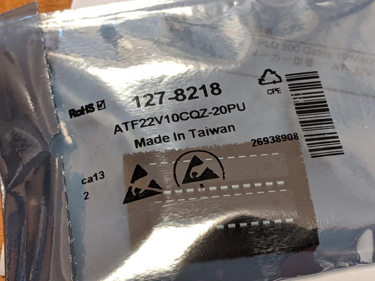
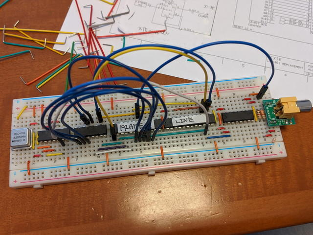

COSMACには[CDP1861 "Pixie"](https://en.wikipedia.org/wiki/RCA_CDP1861 "CDP1861 ")と呼ばれている専用のビデオディスプレイコントローラが用意されています。これを接続すると簡単にNTSCビデオ信号を出力できて、すでに公開されている様々なアプリケーションで利用することができます。

しかし、このCDP1861を販売しているところが見つかりません。海外でも状況は同じのようで、AliexpressやEbayなどでも見かけません。そこでこのCDP1861をリプレースできるデバイスがいくつか公開されています。今回はSpare Time Gizmosさんの[COSMAC Elf 2000](http://www.sparetimegizmos.com/Hardware/Elf2K.htm "COSMAC Elf 2000")用の[STG1861](http://www.sparetimegizmos.com/Hardware/Elf2K_Accessories.htm#STG1681%20Pixie%20Graphics%20Replacement "STG1861")を製作して、[COSMAC MBCボード](https://kanpapa.com/tag/cosmac-mbc "COSMAC MBCボード")に接続してみました。

STG1861の回路図やPLD,JLDファイルは以下のページにまとまっています。

- [Spare Time Gizmos: STG1861 Pixie Graphics Replacement](http://www.sparetimegizmos.com/Hardware/Elf2K_Accessories.htm#STG1681%20Pixie%20Graphics%20Replacement "Spare Time Gizmos: STG1861 Pixie Graphics Replacement")

STG1861のパーツをみるとGAL以外は容易に入手できそうです。GALを探したところ[RSコンポーネンツ](https://jp.rs-online.com/web/ "RSコンポーネンツ")さんに国内在庫がありましたのでオーダーして入手することができました。

<!--more-->

GALの書き込みは[TL866IIPlus](http://www.aitendo.com/product/17038 "TL866IIPlus")で行いました。書き込みに必要なファイルも配布されているのでありがたいです。

まずはSTG1861を[ブレッドボード](http://akizukidenshi.com/catalog/g/gP-09257/ "ブレッドボード")に試作してみました。

完成したSTG1861をCOSMAC MBC CPUボードに接続しました。[前回製作したTVディスプレイボード](https://kanpapa.com/cosmac/blog/2020/01/cosmac-mbc-tv-rev02-finished.html "前回製作したTVディスプレイボード")と同様にUT4モニタを使っている間はDMA OUTを切り離す必要があります。

サンプルプログラムは以下のページにあるものを使用しました。エンタープライズ号が表示される有名な画面です。

- [Popular Electronics JULY 1977](http://billr.incolor.com/elf/html/elf-4-41.htm "Popular Electronics JULY 1977")

しかし、なぜかこのような表示になってしまい安定しません。

オシロスコープを接続してビデオ信号を確認してみましたが、信号レベルは問題なさそうに見えました。誤配線もみつからず、画面上部は綺麗に表示できていることもあり、原因がつかめません。

そこでモニタを普通のテレビに変えてみたところ、

こんなに綺麗に映るじゃないですか。どうやら、今の回路は秋月電子さんのNTSCモニタとは相性が良くないようです。前回製作したTVボードでは問題なかったのですが。

もう少しいじって秋月電子さんのNTSCモニタでも表示できないか試してみようと思います。
