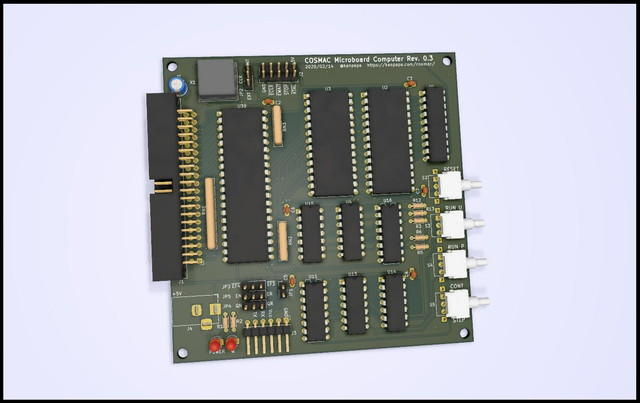

COSMAC MBC CPUボード Rev.0.3の基板を発注しました。

今回のCPUボード Rev.0.3では以下の点を改良しています。

- BUSコネクタを横向き実装とし、できるだけ基板内に収まるように調整しました。
- シリアル入力をEF4、EF3から選択できるようにしました。信号反転もジャンパで設定できるようにした。
- POWERとQ出力にLEDをつけました。
- その他、細かい点を修正しました。

完成イメージは以下のようになります。

今回は工場が再開したようなので[FusionPCB](https://www.fusionpcb.jp/ "Fusion PCB")さんに発注しました。この基板でさらにいろいろ試せると思います。
