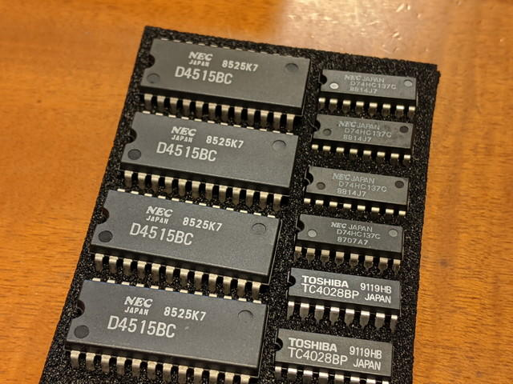
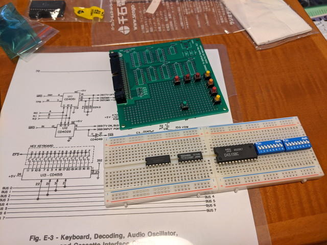
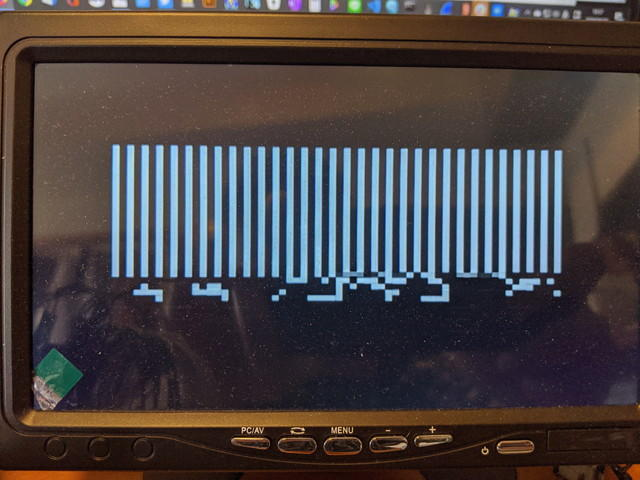
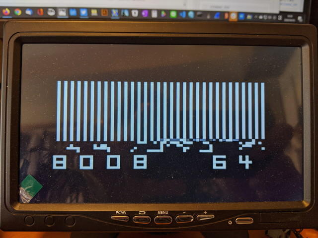
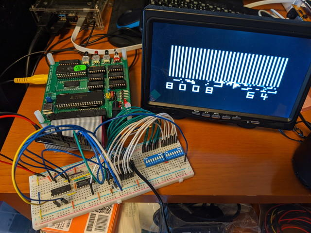

[COSMAC MBC](https://kanpapa.com/cosmac/blog/2020/03/cosmac-mbc-cpu-rev-03-final.html "COSMAC MBC")を使って[COSMAC VIP](http://oldcomputers.net/rca-cosmac-vip.html "COSMAC VIP")を動かしてみることにしました。16進キーボードの回路とCDP1861の表示ON/OFF回路の部分を追加すれば、COSMAC VIPと同等な動作ができるだろうと思ったからです。COSMAC VIPの回路図やモニタプログラムは[RCA COSMAC VIP CDP18S711 Instruction Manual](http://bitsavers.trailing-edge.com/components/rca/cosmac/COSMAC_VIP_Instruction_Manual_1978.pdf "RCA COSMAC VIP CDP188711 Instruction Manual ")に載っています。

また、キーボード入力に使われているCMOSロジックIC 4515が入手できたことも理由です。4515は24P DIPの大きさで私も見たことがありませんでした。

COSMAC VIPの回路図を参考にブレッドボードに組み上げました。本来はプッシュスイッチが16個必要ですが、プロトタイプということでDIPスイッチでON-OFFをすることで、プッシュスイッチを押したと同じように見せかけます。

また、[STG1861](https://kanpapa.com/cosmac/blog/2020/02/cdp1861-pixie-stg1861.html "STG1861")側もDISP ON/OFFを引き出すために若干改造しています。

COSMAC VIPのモニタに相当するOSは512バイトです。これはEEPROMに書き込んで、COSMAC MBC CPUボードに取り付けました。

COSMAC VIPのマニュアルによると"C"キーを押しながら立ち上げる必要があるようです。DIPスイッチの"C"に相当するところをONにしたままリセットをしたところ、ランダム模様の画面が表示されました。

特にCOSMAC VIPという表示もなく、これはなんだろう？というような画面です。初めてCOSMAC VIPの電源を入れた人は壊れているんじゃないかと思ってしまったかもしれません。

マニュアルの指示通りにアドレス４桁をDIPスイッチで入力したところ、突然アドレスとメモリの内容が16進数で表示されました。

続いてメモリの書き込みをテストします。VRAMに書き込むと画面に変化があるはずです。

COSMAC VIPは標準は2KB RAMで、4KBまで拡張できるそうです。COSMAC MBCは32KBのRAMがあるので、多分4KBと認識されているので、VRAMは0F00からのはずです。マニュアルにしたがって、アドレス0F00を入力して、書き込みモードの0を押して、AAの値を書き込んだところ、画面の左上の表示が変化しました。

このテスト動画をYouTubeにアップしておきました。

ここまでの確認で問題はありませんでしたので、正常に動作しているようです。すでに発注した基板の到着が待ち遠しいです。

