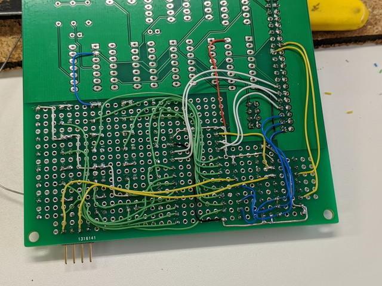
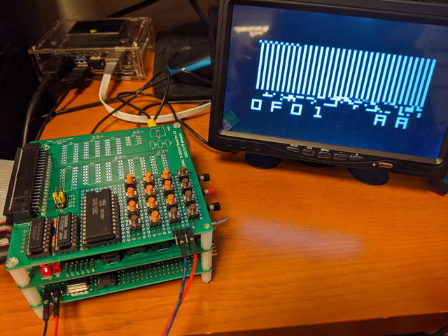

[ブレッドボードでDIPスイッチを使ったCOSMAC VIPの16進キーボードを製作](https://kanpapa.com/cosmac/blog/2020/04/cosmac-mbc-vip-proto1.html "COSMAC VIPをCOSMAC MBCで動かしてみました")しましたが、やはりプッシュスイッチでないと使い勝手がよくありません。そこで、先日作成した[TVディスプレイボード](https://kanpapa.com/cosmac/blog/2020/01/cosmac-mbc-tv-rev02-finished.html "TVディスプレイボード")のユニバーサル領域に実装してみることにしました。

はんだ付けが完了したCOSMAC VIPの16進キーボードはこのようになりました。

<!--more-->

裏面はこのような感じです。

実際にCOSMAC MBCに接続して動作確認を行いました。DIPスイッチにくらべて格段に操作性はよくなりました。

動くには動くのですが、COSMAC VIPのOSが起動しないことや、使っているといつの間にか動かなくなるなど、やや不安定な状態です。

うまく動いている場合は、VRAMへの書き込みもできるので、回路には問題ないようですが、実装上の問題がありそうなので原因を調べてみます。

