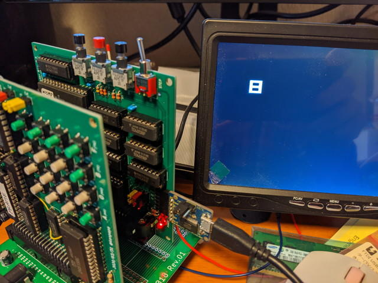

[COSMAC VIP OSがRAMで動く](https://kanpapa.com/cosmac/blog/2020/04/cosmac-vip-os-ram1.html "COSMAC VIP OSをRAMエリアで起動させてみました")ようになりましたので、次はCHIP-8インタプリタを動かしてみます。

## CHIP-8とは

[CHIP-8の詳細はWikipedia](https://en.m.wikipedia.org/wiki/CHIP-8 "CHIP-8")を参照いただくこととして、[RCA COSMAC VIP CDP18S711 Instruction Manual](http://bitsavers.trailing-edge.com/components/rca/cosmac/COSMAC_VIP_Instruction_Manual_1978.pdf "RCA COSMAC VIP CDP188711 Instruction Manual")にはアプリケーションとして、このCHIP-8インタプリタのダンプリストとCHIP-8で書かれたゲームなどのプログラムが載っています。これもぜひ動かしたいところです。

ただ、CHIP-8インタプリタやCHIP-8アプリケーションをCOSMAC VIP OSのHEXキーボードで入力するのはかなりしんどいので、プログラム入力は[MCSMP20モニタ](http://www.sunrise-ev.com/1802.htm "The 1802 Membership Card")の機能を使うことにします。

## CHIP-8インタプリタの改造

CHIP-8インタプリタはCOSMAC VIP OSのサブルーチンやデータをいくつか使用していることが分かっていますので、呼び出し先アドレスをRAM版のCOSMAC VIP OSに変更する必要があります。キーボードもEF4にしているのでそちらも同様に変更です。[COSMAC VIP OSをRAMで動かした](https://kanpapa.com/cosmac/blog/2020/04/cosmac-vip-os-ram1.html "COSMAC VIP OSをRAMエリアで起動させてみました")ときと同様に、CHIP-8インタプリタのダンプリストを解析して、バイナリパッチを当てることにしました。

解析の結果、CHIP-8インタプリタの修正箇所は以下の部分になります。

- $000A $81 → $71

- $010B $81 → $71

- $012A $81 → $71

- $019E $36 → $37

- $01A1 $3E → $3F

もう一つ問題があります。オリジナルのCOSMAC VIPでは、RESET後にCOSMAC VIP OSが起動し、メモリ容量を確認して、R1レジスタにRAMの最終アドレス(=VRAMの最終アドレス）をセットします。その後、$0000にあるCHIP-8インタプリタを実行し、R1.1のVRAMの先頭アドレスをR11.1にセットしてインタプリタが動き始めます。

このため、CHIP-8インタプリタを直接起動しても、R1に何も値が入っていないため誤動作します。そこで、R11.1にVRAMの上位アドレスの$F0がセットされるように$6000に置いたツールを実行して戻ってくるようにしました。このツールにJUMPするように$0000からパッチをあてます。

- $0000 C0 60 00 LBR $6000

ツールのアセンブルリストは以下になります。このプログラムを$6000に配置します。

```
6000-F8 0F    START: LDI $0F ;$0F->R11.16002-BB              PHI 116003-FF 01 　        SMI $016005-C0 00 04        LBR $0004
```

最終的なメモリマップは以下のようになります。


## CHIP-8の起動方法

(1) MCSMP20を起動します。

(2) COSMAC VIP OS RAM版を$7000にロードします。

(3) CHIP-8インタプリタを$0000にロードします。

(4) CHIP-8インタプリタに以下のパッチをあてます。（パッチをあてた状態でSaveしておくと良いです。

- W0000 C0 60 00

- W000A 71

- W010B 71

- W012A 71

- W019E 37

- W01A1 3F

(5) レジスタを設定するツールを$6000に書き込みます。

- W6000 F8 0F BB FF 01 C0 00 04

(6) CHIP-8のテストプログラム本体を$0200から書き込みます。

- W0200 A2 0A 61 00 62 00 D1 25 12 08 F0 90 F0 90 F0 00

このCHIP-8のプログラムのソースは以下になります。（COSMAC VIPマニュアルから引用）

```
0200 A20A I=020A0202 6100 V1=000204 6200 V2=000206 D125 SHOW 5MI@V1V20208 1208 GO 0208020A F090020C F090020E F000
```

(7) RUN Pスイッチを押して$0000から実行するとCHIP-8インタプリタが実行を開始し、SHOW命令で画面に数字の８が表示されます。



(8) 他のCHIP-8プログラムを動かしたい場合は、RESET, RUN Uスイッチを押してMCSMP20モニタを起動し、動かしたいCHIP-8プログラムを$0200以降に書き込んで、RESET+RUN PでCHIP-8インタプリタが動きます。

## CHIP-8のプログラム実行例

### アニメーション

テストに使ったプログラムのV1, V2を変更すれば表示位置を変えることができますのでその応用です。



### カウンタ

単純にカウントアップするものです。CPU基板のQ出力のLEDも同時に点滅しています。COSMAC VIPではQ出力にブザーがつながっているので、本来であればカウントアップ時に音が鳴るのでしょう。



他のCHIP-8のプログラムも試してみようと思います。
