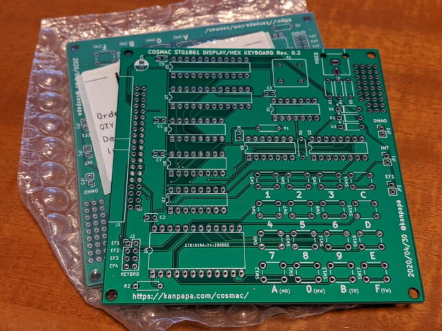
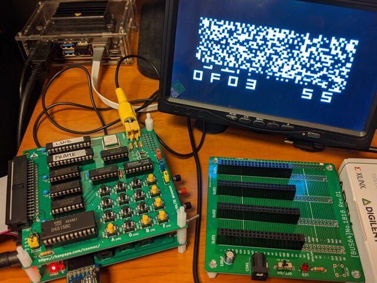

先日発注した[COSMAC STG1861 DISPLAY/HEX KEYBOARD Rev. 0.2](https://kanpapa.com/cosmac/blog/2020/05/cosmac-mbc-stg1861-keyboard-rev02.html "COSMAC STG1861 DISPLAY/HEX KEYBOARD Rev. 0.2の基板を発注しました")の基板が到着しました。

<!--more-->

早速製作しました。Rev. 0.1で漏れていたゲートも追加実装し、ちょっとしたユニバーサル領域も付いています。

CPUボードに接続し、COSMAC VIP OSを動かしたところ、問題なく動作しました。

STG1861 DISPLAY/HEX KEYBOARDはこれで完成です。基板があと4枚ありますので、予備としてもう1枚製作しておこうと思います。

※専用基板のジャンパー部分のシルク印刷がまちがっていました。  
　yanakata様ご指摘ありがとうございました。  
　　　誤）JP1 INT, JP2 EF1  
　　　正）JP1 EF1, JP2 INT
