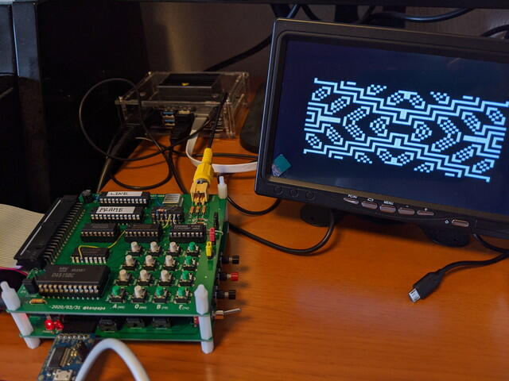

[COSMAC VIPマニュアル](http://bitsavers.trailing-edge.com/components/rca/cosmac/COSMAC_VIP_Instruction_Manual_1978.pdf "http://bitsavers.trailing-edge.com/components/rca/cosmac/COSMAC_VIP_Instruction_Manual_1978")のAppendix DにはVideo Gameが20本も掲載されています。[CHIP-8インタプリタが動き出した](https://kanpapa.com/cosmac/blog/2020/04/cosmac-vip-chip-8-startup.html "COSMACでCHIP-8インタプリタを動かしてみました")ので、いくつかのプログラムで遊んでみました。

### VIP Kaleidoscope

万華鏡です。最初にHEXキーで初期パターンを設定し、実行すると規則的なパターンが展開されます。様々な形に変化していくのが楽しいです。CHIP-8のコードは$0200-$0279でした。

実行中のビデオも掲載しておきます。

https://youtu.be/6uIpNWMAVO4?si=cGwRjYeEsDBCZMnz

### VIP Wipe Off

パドルでボールを跳ね返しながら画面上の点を消していくゲームです。パドルはHEXキーで動かします。ブロック崩しに似ていますね。初期値のパドルの大きさだと難しかったので、プログラムを書きかえて少し大きくしています。CHIP-8のコードは0200-$02CDでした。

こちらも実行中の動画です。

https://youtu.be/coM34auZOjg?si=whU1kCTT6Zyyhp1j

### VIP Space Intercept

通り過ぎていくUFOに向けてロケットを発射します。当たれば得点です。小さいUFOの得点が高いです。ロケットを発射する向きは３方向あり使い分けて発射できます。CHIP-8のコードは0200-$02DFでした。

実行中の動画です。

https://youtu.be/Ne8abozQoVU?si=5xbIYHVs9Z2RiS7f

ビデオゲーム初期のレトロな雰囲気が味わえますね。

まだまだゲームは残っていますが、今後ゆっくりと入力してみようと思います。
