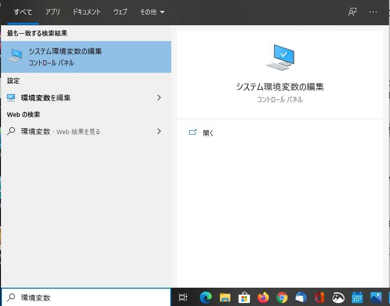
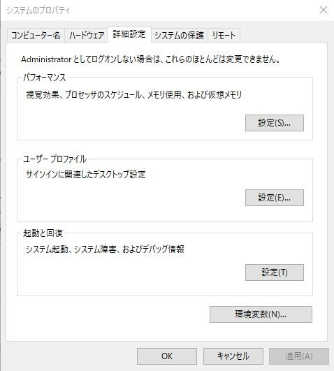
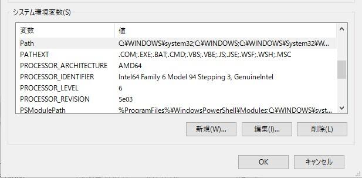
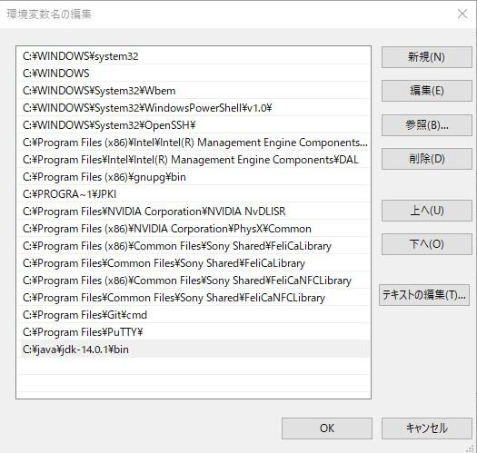

KiCadでの基板設計時に自動配線ツールとして、[kosakaさんのKiCad本](https://booth.pm/ja/items/941963 "KiCad 5.0 / 5.1 入門実習テキスト『KiCad Basics for 5.x』 #マッハ新書")で紹介されている、Freerouter 1.2.43 Extra（freeroute.jar）を使用しています。

これまでは個人利用ということで、[Oracle JRE 8](https://java.com/ja/download/ "Oracle JRE8")で動かしていましたが、今後のことも考えオープンソース版のJAVAである[OpenJDK](https://openjdk.java.net/ "OpenJDK")の環境で動かしてみました。OpenJDKにはJREのようなインストーラーがついていないので、環境変数の設定などは手で行わなければなりません。その手順をまとめておきました。環境はWindows 10です。

なお、作業の前にこれまで使っていたJRE 8はアンインストールしています。

## OpenJDKのダウンロード

[OpenJDKの公式サイト](https://jdk.java.net/14/ "OpenJDK14")からダウンロードします。最新のものはOpenJDK 14で、現時点でのファイル名はopenjdk-14.0.1\_windows-x64\_bin.zipです。

ダウンロードしたzipファイルを展開すると、バイナリがそのまま入っています。

このjdk-14.0.1のフォルダを適当なところに移動します。私の場合は、C:\\java\\jdk-14.0.1 に置きました。

<!--more-->

## 環境変数の設定

検索ボックスで「環境変数」と入力すると、「システム環境変数の編集」というコントロールパネルがでてきますので、これをクリックします。

「システム環境変数の編集」コントロールパネルの「環境変数(N)」のボタンをクリックします。

環境設定の編集画面が表示されます。

システム環境変数のJAVA\_HOMEに合わせて「編集」ボタンを押します。もし、JAVA\_HOMEが無ければ「新規」ボタンを押してください。

表示されるダイヤログに以下のように入力します。

- 変数名: JAVA\_HOME
- 変数値: C:\\java\\jdk-14.0.1

設定が終わったらOKボタンをおします。

続いてpath変数を設定します。システム環境変数のpathという変数を探して、「編集」を押してください。

次のダイヤログで、「新規」を押して、以下のように入力します。

- C:\\java\\jdk-14.0.1\\bin

OKを押してシステム環境変数の設定は完了です。

## OpenJDKの動作確認

コマンドプロンプトを起動して、java -versionと入力します。

ここでインストールしたOpenJDKのバージョンが表示されれば環境設定は完了です。

## freeroute.jarの動作確認

freeroute.jarをそのままクリックしても動きません。これは.jarファイルと今回インストールしたOpenJDKの紐づけができていないためです。以下の方法で紐づけを行います。

1. freeroute.jar を右クリックしてプロパティを表示します。 
2. プログラムの「変更(C)」ボタンを押して、\[その他のアプリ\]をクリックし、「このPCで別のアプリを探す」をクリックし、C:\\java\\jdk-14.0.1\\bin\\javaw.exe を紐づけます。

これでfreeroute.jarをダブルクリックすれば起動するようになります。

## 実は新しいバージョンが提供されていました

今回の作業を行っている最中にfreeroute.jarは新しいバージョン1.4.4が提供されていることがわかりました。

- [Freerouting(PCB Autorouter)](https://freerouting.mihosoft.eu/ "Freerouting(PCB Autorouter)")

なんと、Windowsインストーラー版もリリースされていて、Javaのランタイムが含まれています。こちらを試しに動かしてみたところ、問題なく自動配線が行われるようにみえます。

というわけで、この記事はもう必要なくなったかもしれません。

なお、新しいバージョンの.jarもリリースされており、今回のOpenJDKの環境でも動きます。

まあ、最新版のOpenJDKの実行環境が構築できたということで良しとしましょう。
