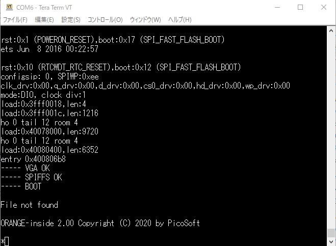
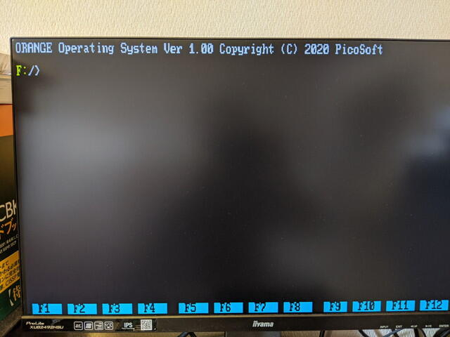

先日[ORANGE-ESPerを組み立て](https://kanpapa.com/2020/05/orange-esper-kit-assembly.html "小さなIoTパソコン ORANGE-ESPerを組み立てました")ましたが、それに載せる予定の[ORANGE-OS](http://www.picosoft.co.jp/ESP32/index.html "ORANGE-OS")の一部が公開されましたので、さっそくインストールしてみました。すでに公開されているマニュアルの手順に沿って進めれば簡単に動作します。

1\. USBシリアルからORANGE-insideをESP32に書き込みます。付属のツールで簡単です。

 <!--more-->

2\. ESP32のリセットを行うと簡単なモニタに相当するORANGE-insideが起動します。

3\. ORANGE-insideのlコマンドを使って、1つずつORANGE-OSのファイル群を読み込み、sコマンドでESP32に書き込みます。fコマンドでフラッシュメモリに書き込まれたファイル名を確認できます。ファイル名がどこかでみたようなコマンド名になっているようです。

4\. 準備ができたところで、oコマンドでORANGE-OSを起動し、VGA出力にモニタを接続したところ、ORANGE-OSの起動画面が表示されました。

しかし、この状態でPS/2キーボードをつないだところ、文字が入力できません。リセットしても同じです。おかしいなと思っていたら、USBキーボードで動いたというTweetをいただいたので、USBキーボードを接続したところ文字入力ができました。

マニュアルにあるWiFi設定も行って再起動したところ、IPアドレスが割り当てられました。特に日付を設定していないのにDATEコマンドで正しい日付が表示されるのでネットワークから時刻を設定しているようです。ORANGE-OSにNTPクライアントが入っているのでしょう。画面の右下にも時刻が常に表示されています。

ここまで動くと欲しくなるのはtelnetやftpといったコマンドです。これらも[ORANGE-studio](http://www.picosoft.co.jp/ORANGE-studio/ "ORANGE-studio") Ver. 2.0という開発環境でBASICを使って書けるそうです。[μUX](https://www.amazon.co.jp/BASIC-%CE%BCUX%E2%80%95BASIC%E3%81%AB%E3%82%88%E3%82%8BUNIX%E3%83%A9%E3%82%A4%E3%82%AFOS%E3%81%AE%E8%A8%98%E8%BF%B0-ver-3-0-programmer%E2%80%99s-manual/dp/4871487504 "BASIC+OS=μUX")を思い出します。今後が楽しみです。
