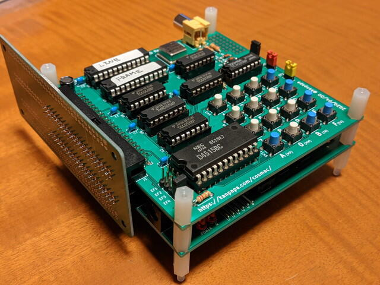
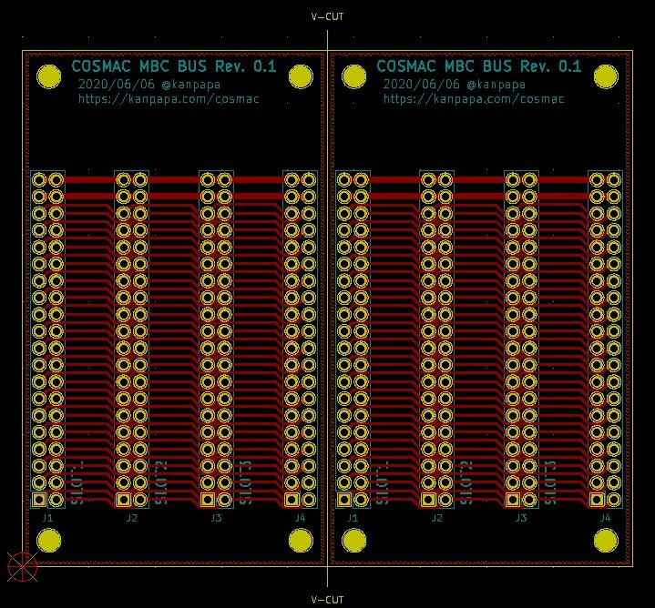

以前、tomi9さんから頂いた小さいバス基板をCOSMAC MBCで使ってみました。  
COSMAC VIPは16進キーボードがあるので横向きの実装が望ましく、この小さいバス基板はぴったりです。  
フラットケーブル接続よりもコンパクトに収まりかっこいいです。

<!--more-->

そういえば、高校のときに使っていたTK-80BSもこのようなバス基板でCPUボードとBASICボードを接続していたのを思い出しました。

今後もバス基板を使っていきそうなので、COSMAC MBC用に同様なバス基板を作ってみることにしました。実装イメージはこんな感じです。

久しぶりに面付したガーバーデータを作って発注しました。

特に急いではいませんが、到着が楽しみです。
