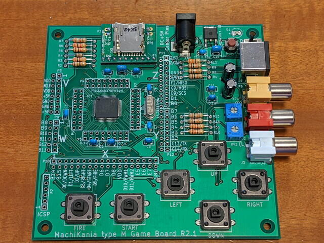
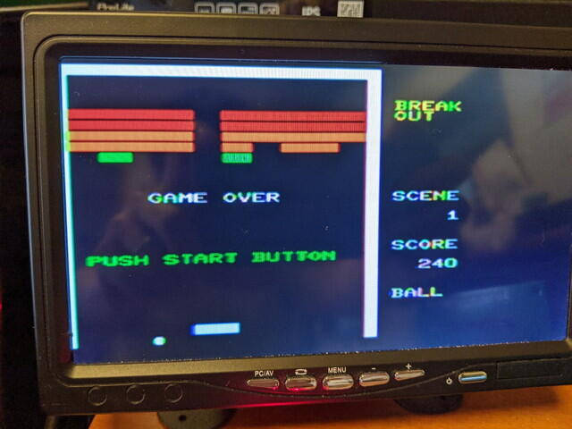
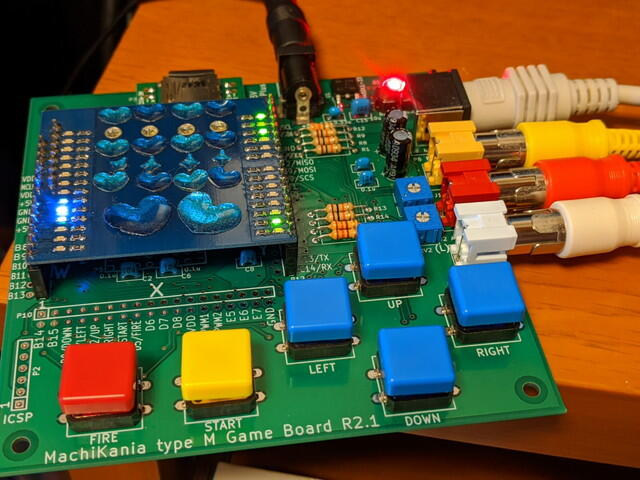

以前、秋葉原に行ったときに[MachiKania type M](http://www.ze.em-net.ne.jp/~kenken/machikania/typem.html "MachiKania type M")の基板を買っていたのを思い出しました。

ある程度のパーツは買ってあったと思うので組み立ててみました。PIC32MX370は直接はんだ付けしました。47μFの電解コンが無かったので33μFで代用し、LEDは表面実装がかっこいいかなと思い使用しました。ひとまず完成です。

 <!--more-->

まだ外部拡張用コネクタをはんだ付けしていませんが、動作確認をしてから取り付けることにします。

久しぶりのPICkit3でファームの書き込みです。特に問題なく書き込めました。

ディスプレイを接続し、電源をいれたところファイル選択画面が表示されました。このあたりは[以前製作したMachiKania](https://kanpapa.com/2016/02/machikania-pacman.html "BASIC搭載カラーテレビゲームシステムMachiKaniaのパックマンで遊んでみた")と同じです。

サンプルアプリを動かしたところ、問題なくゲームが動きました。

ここで残りの外部拡張用コネクタをはんだ付けです。動作確認はどうしようかなと思っていたら、Arduino用の[Decoシールド](http://dev.tetrastyle.net/2012/08/deco.html "Decoシールド")があるのを思い出しました。これを使ってみます。

MachiKaniaに搭載されているKM-BASICのOUT命令を使うと簡単にLEDを点灯できるはずなので、次のようにプログラムしてみました。適当に作ったのでもっと良い書き方があるかもしれません。

Decoシールドを取り付けて、プログラムを実行したところ無事点滅しました。

YouTubeにも動作中の様子をアップしておきました。

ゲームもできて電子工作もできていろいろ使えそうです。Arduino用のLCDモジュールも注文しておいたので、届いたらそれも試してみようと思います。
