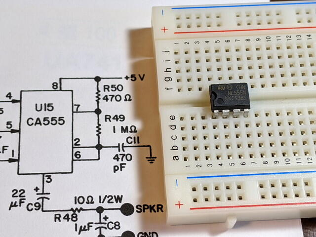
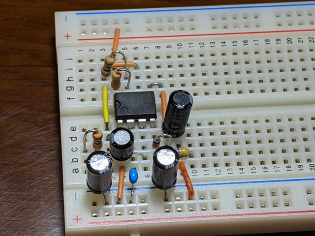
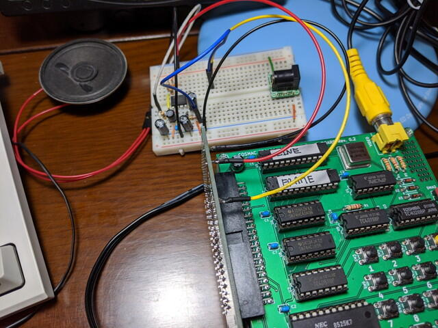

COSMAC VIPにはタイマーIC555を使用したサウンド回路が搭載されています。555といえば一度は触ったことがあるのではないかと思います。

<!--more-->

COSMAC MBCにも同じサウンド回路を接続してみようと、ブレッドボードで試作しました。

この回路をQ出力とスピーカー、電源に接続します。[先日製作したバス基板](https://kanpapa.com/cosmac/blog/2020/07/cosmac-mbc-bus-rev-02-assembly.html "COSMAC MBC BUSボード Rev. 0.2が届きました")に[スルーホール用テストワイヤー](http://akizukidenshi.com/catalog/g/gC-09830/ "スルホール用テストワイヤ　ＴＰ－２００")で接続しました。

接続前にQ入力をHI, LOWにして音が出たり、止まったりすることは確認しました。思ったより大きな音です。

実際にCHIP-8のゲームプログラムを動かしてみました。なかなか良い感じです。

当時と同じ回路なので1970年代のCOSMAC VIPのオーナーは同じ音を聞きながらゲームをしていたのかと思うとすこしワクワクします。

他のCHIP-8プログラムも動かして試してみたいと思います。
