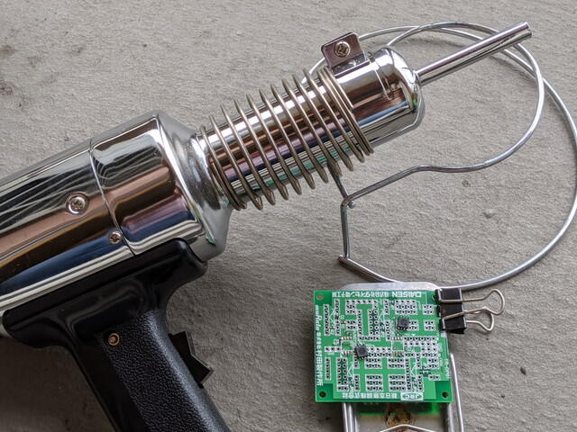

古本の整理をしたところ、オペアンプの実験用基板とCD-ROMが付いている[トラ技2007年4月号](https://toragi.cqpub.co.jp/tabid/179/Default.aspx "組み合わせ自由自在! 万能OPアンプ基板")を見つけました。CD-ROMにはWindows2000/XP用と懐かしのOSが書かれていました。このまま捨ててしまうのももったいないので、実験用基板からオペアンプを外して、ブレッドボードで再利用できるようにしてみました。

これがオペアンプの付録基板です。右側の[1.27mmピッチの表面実装パッケージ(SOP8)をDIP8Pに変換する基板](http://akizukidenshi.com/catalog/g/gP-05154/ "ＳＯＰ８（１．２７ｍｍ）ＤＩＰ変換基板　金フラッシュ　（９枚入）")に乗せ換えます。

 <!--more-->

基板には[NJU7043](http://akizukidenshi.com/catalog/g/gI-06840/ "２回路入入出力フルスイングオペアンプ　ＮＪＵ７０４３Ｄ")Mと[NJM2732M](http://akizukidenshi.com/catalog/g/gI-06018/ "２回路入入出力フルスイングオペアンプ　ＮＪＭ２７３２Ｍ")が表面実装されています。周りにあるパターンにSIPソケットをはんだ付けし、他のパーツやジャンパを組み合わせて、トラ技に掲載されている実験回路を再現するしくみですが、私はブレッドボードのほうが慣れていて楽です。

表面実装のパーツをダメージを与えずにとりはずすには熱風加工機（ヒートガン）を使います。私は[プラジェットPJ-208A1](https://www.sure-ishizaki.co.jp/tool/plajet/handy/pj-208a1/ "プラジェットPJ-208A1")をなぜか持っていますのでこれを久しぶりに使います。この工具は400℃を超える熱風が出ますので、取り扱いには注意が必要です。

しばらく熱風を当てていると突然はんだが溶けて、チップがポロっと取れます。今回はチップが小さいので熱風で吹き飛んでしまいました。

あとは外れたチップを向きを間違えないように変換基板に半田づけしました。これでブレッドボードで気軽につかえるようになりました。

せっかくですので、簡単な実験をしてみます。以下のような増幅回路をブレッドボードに組んでみます。増幅率は２倍になるはずです。

入力信号は秋月電子の[ファンクションジェネレーターminiDDS](http://akizukidenshi.com/catalog/g/gK-06298/ "ファンクションジェネレータキット＜ｍｉｎｉＤＤＳｋｉｔ＞")を使って、サイン波を入力します。

入力信号と、出力信号には[USBオシロスコープ](http://akizukidenshi.com/catalog/g/gM-12600/ "ＵＳＢオシロスコープ　２０Ｍ２ｃｈ４８Ｍｓｐｓ　２０５Ａ")をつなぎます。

この状態で、信号を観察してみると、

設計通りにちょうど２倍の大きさになっています。

ノコギリ波も入力してみました。

いつもデジタルばかりですが、たまにはアナログも良いですね。
