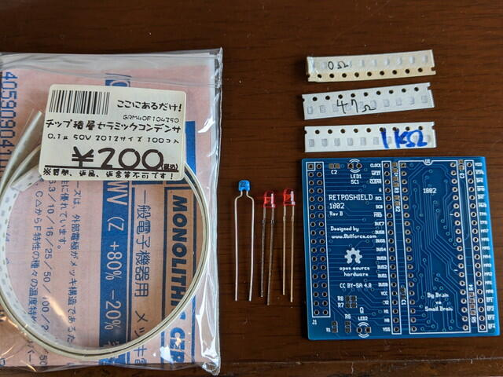
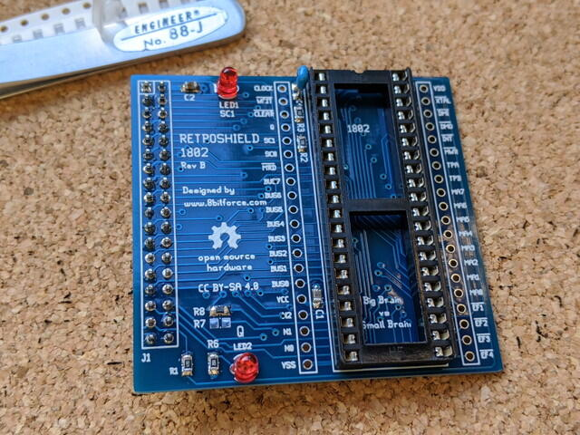
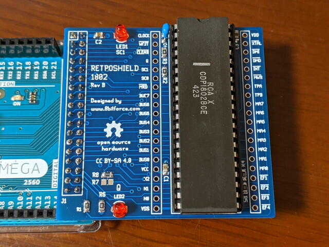
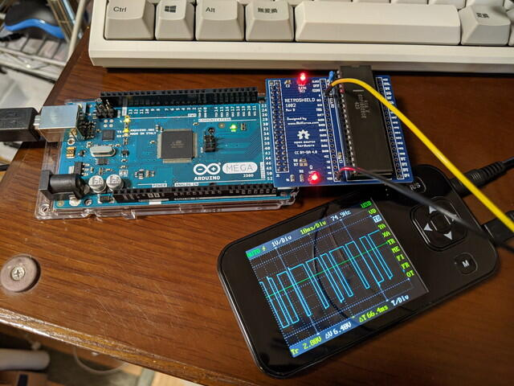

[オレンジピコショップ](https://store.shopping.yahoo.co.jp/orangepicoshop/ "オレンジピコショップ")さんにいただいた[RetroShield 1802](https://store.shopping.yahoo.co.jp/orangepicoshop/pico-a-034.html "RetroShield専用プリント基板")を組み立ててみました。

まずは[事前に調べた部品表](https://kanpapa.com/cosmac/blog/2020/08/cosmac-retroshield-1802.html "COSMAC RetroShield 1802基板をいただきました")に沿ってパーツを集めてみました。

0.1μF(2012サイズ)は手持ちがありましたが、他の表面実装パーツは同じものは無く近い値のものとしました。回路図をみたところ、680ΩはLED点灯とプルアップ用だったので手持ちの1KΩを使い、高輝度のLEDを使用することで問題ないかなと考えました。22pFは通常の積層セラミックコンデンサを実装です。

完成した基板は以下のようになりました。

これにCOSMAC CPUを載せて、Arduino Megaに接続します。

Arduinoで動かすソフトウェアですが、[GitHub](https://gitlab.com/8bitforce/retroshield-arduino "retroshield-arduino")にスケッチと必要なものがあるので、それをArduinoのフォルダにコピーしてArduino Mega用にコンパイルします。私の場合はライブラリが足りなかったので、[DIO2](https://www.arduinolibraries.info/libraries/dio2 "Fast digital input/output functions.")というライブラリを追加したところ、無事コンパイルできました。あとはいつも通りにArudino Megaに転送します。

スケッチをみたところ、シリアルモニタに情報が出力されるようなので、Arduino IDEのシリアルモニタで動作を確認しました。通信速度は115200bpsで、改行コードは「CRのみ」としました。「Hit ENTER to staret monitor code.」と書かれているように、CRコードを入力するとモニタが動きました。

このように、Membership Cardのモニタが動き、RCAのBASICも動きます。ただし、メモリやI/Oをエミュレーションしているためかモニタの表示速度は少し遅いですが、手軽にCOSMAC CPUを試すには良いのではないかと思います。

動作中の写真ではQ出力にオシロスコープを接続してシリアル信号の出力を確認しましたが、COSMAC CPUの全ピンの入出力を確認することができますので、ロジックアナライザをつないでみるのも楽しいでしょう。
