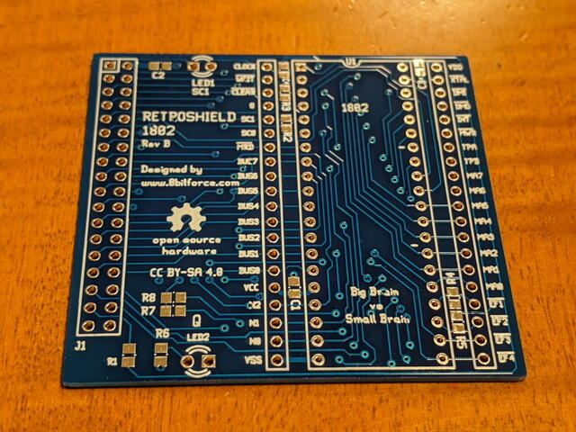

いつもお世話になっている[オレンジピコショップ](https://store.shopping.yahoo.co.jp/orangepicoshop/ "オレンジピコショップ")さんからCOSMAC用の[RetroShield専用プリント基板](https://store.shopping.yahoo.co.jp/orangepicoshop/pico-a-034.html "RetroShield専用プリント基板")をいただきました。

<!--more-->

Arduino MegaがメモリーやI/Oをエミュレーションしてくれるので、COSMACなどの少し古いCPUをお手軽に動作させることができます。基板を見るとわかりますが接続回路はシンプルです。

ちょうどArduino Megaも持っているので組み立てればすぐ確認できそうです。早速、回路図からパーツリストを起こしてみました。

RetroShield 1802 Rev.B Parts List  
\--- 
U1 1802  
R1 33Ω\*  
R2,R3,R4,R5,R6 680Ω\*  
C1,C2,C3 0.1uF\*  
C4 22pF\*  
LED1,LED2 3mmLED  
2x18 pin header  
40P dip socket  
\*Size:0805(2012)

この基板は抵抗やコンデンサはすべて0805(2012)の表面実装パーツになっています。手持ちがあると良いのですが、ちょうどいいものがなければ1608とか1/6W抵抗とかをうまくつかって実装してみようと思います。
