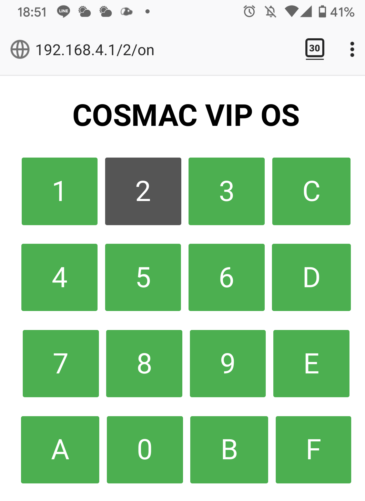

10月に行われる[Maker Faire Tokyo 2020の出展](https://kanpapa.com/cosmac/blog/2020/07/cosmac-lab-maker-faire-tokyo-2020.html "COSMAC研究会はMaker Faire Tokyo 2020へ出展いたします")に向けてCOVID-19の対策を考えています。来場者の皆様が作品を直接触らなくても試せるように今回の展示の中心となるCOSMAC MBC（COSMAC VIP相当）の16進キーボードをスマホで操作できるように試作中です。

<!--more-->

試作中のシステムの写真です。ハードウェアは[ESP32-DevKitC](http://akizukidenshi.com/catalog/g/gM-11819/ "ESP32-DevKitC ESP-WROOM-32開発ボード")と3.3V/5Vレベル変換IC、16チャンネルリレーモジュールといったシンプルな構成です。リレーモジュールは12Vの電源が必要です。

このリレーユニットにCOSMAC VIPのキーボードの回路を接続すれば同じように動作できるはずです。

ESP32のGPIOに16チャンネルのリレーモジュールを接続し制御できるようにします。さらにESP32上でWiFiのホストとしてWebサーバを動かします。このESP32のWiFiのAPにスマホを接続し、WebブラウザからCOSMAC VIPの16進キーをON/OFFできるように考えています。

テストしている状況をYouTubeにアップしておきました。

今回あえてリレーにしているのは、リレーの動作音でスイッチをON/OFFしていることを実感していただきたかったためです。

まだパーツがそろっていないので８チャンネルしか動作していないのですが、１６チャンネルの動作確認ができた時点でユニバーサル基板に実装しようと考えています。

タクトスイッチでの操作と違い素早い入力はできませんので、デモのシナリオも簡単なものとなってしまいそうですが、今後は説明資料の作成に入ります。
