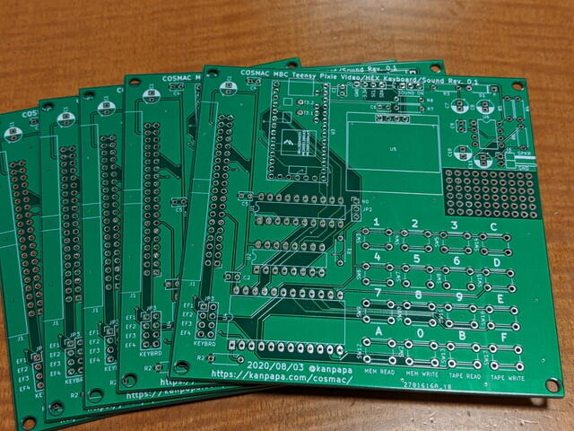
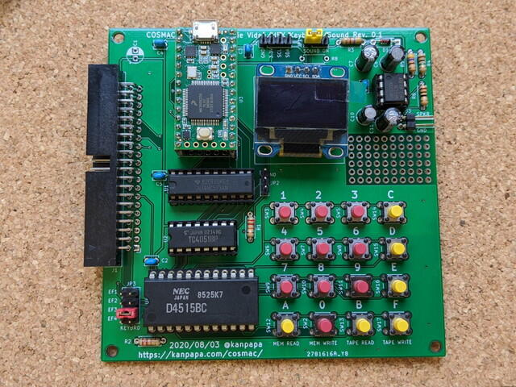
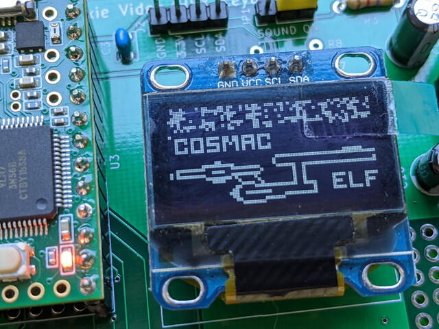
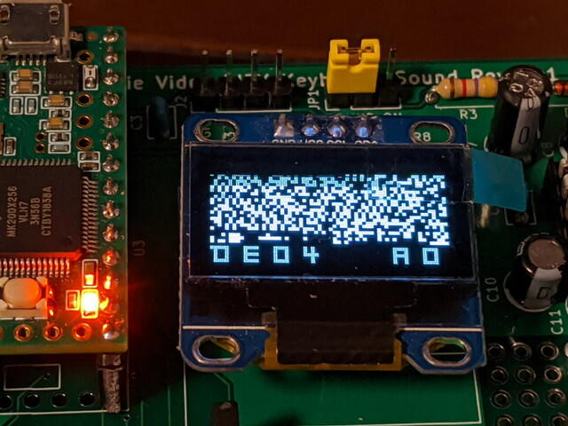

8月4日に発注した[Teensy Pixie Video/HEX Keyboard/Soundボード Rev. 0.1の基板](https://kanpapa.com/cosmac/blog/2020/08/teensy-pixie-hexkey-sound-board01.html "Teensy Pixie Video/HEX Keyboard/Soundボード Rev. 0.1を発注しました")が8月13日に到着しました。

<!--more-->

早速[試作したブレッドボード](https://kanpapa.com/cosmac/blog/2020/08/teensy32-cdp1861-pixie-simulator.html "Teensy 3.2でのCDP1861 Pixie Simulatorを試してみました")からパーツを移して実装しました。別に[試作していたサウンド回路](https://kanpapa.com/cosmac/blog/2020/07/cosmac-vip-555-sound.html "COSMAC VIPのサウンド回路を実装しました")も合わせて実装です。

COSMAC MBC BUS基板を介して、COSMAC MBC CPUボードに接続し、サンプルプログラムを動かしてみたところ、無事画像が表示されました。

OLEDの表示は正常に動作しているようです。

COSMAC VIP OSを動かして、HexキーボードとSoundの動作も確認しましたが、VIP OSは画面がちらついて見づらい状況でした。スタックエリアが刻々と変化する様子もOLEDでは確認できません。

これは、CDP1861の場合1/61秒の速度で画面を表示していますが、OLEDの場合は1/5秒の速度となっているためのようです。このように使う用途は選びますが、外部ディスプレイが不要で、手軽に表示できるのはうれしいところです。

なお、本表示回路及びTeensy 3.2のファームウェアは以下を参考にしています。公開いただいているGaston Williamsさんに感謝します。

MCard1802TeensyPixieVideo  
[https://github.com/fourstix/MCard1802TeensyPixieVideo](https://github.com/fourstix/MCard1802TeensyPixieVideo "MCard1802TeensyPixieVideo")  
Copyright (c) 2020 by Gaston Williams
