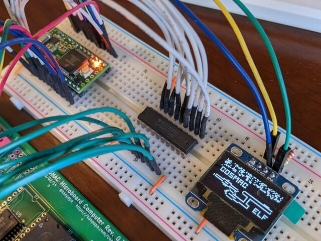

私は英語は苦手なのですがCOSMACコミュニティの情報を入手するために[COSMAC ELF Group](https://groups.io/g/cosmacelf "COSMAC ELF Group")のメールを購読しています。その中でも興味あるプロジェクトの投稿を見かけました。

- [Pixie Video Simulator using a Teensy 3.2](https://groups.io/g/cosmacelf/message/27398 "Pixie Video Simulator using a Teensy 3.2")

PJRC社の[Teensy 3.2](https://www.pjrc.com/teensy/ "Teensy 3.2")という ARM Cortex-M4が載ったArudinoコンパチのボードを使って、入手が困難な[CDP1861 Pixie](https://en.wikipedia.org/wiki/RCA_CDP1861 "CDP1861 Pixie")と同じ動きをさせようというプロジェクトです。これを利用するとI2CのLCDにPixieの画面を表示することができます。詳しい情報はプロジェクトオーナーのGaston WilliamsさんのGitHubにあります。

- [fourstix/MCard1802TeensyPixieVideo](https://github.com/fourstix/MCard1802TeensyPixieVideo "MCard1802TeensyPixieVideo")

Teensy 3.2は国内でも入手が容易です。

- [Teensy 3.2（スイッチサイエンス）](https://www.switch-science.com/catalog/2447/ "Teensy 3.2（スイッチサイエンス）")
- [TEENSY 3.2 + HEADER【2756】（マルツ）](https://www.switch-science.com/catalog/2447/ "Teensy 3.2（スイッチサイエンス）")
- [DEV-13736 Teensy USB Development Board - Teensy 3.2（千石電商）](https://www.sengoku.co.jp/mod/sgk_cart/detail.php?code=EEHD-4V55 "DEV-13736 Teensy USB Development Board - Teensy 3.2")
    

今回購入したTeensy 3.2です。

小さいですけどCortex-M4 72MHzのパワーを持っています。また、5VトレラントなのでCOSMACとの組み合わせでも使いやすく、3.3V(250mA max)のレギュレーターも搭載されているので、[I2CのOLED](http://akizukidenshi.com/catalog/g/gP-12031/ "0.96インチ 128x64ドット有機ELディスプレイ(OLED)")にはここから電源を供給しました。今回はArduino IDEでプログラムします。

<!--more-->

回路図にあるラッチIC 74LS374は持っていないので代わりに74HC573を使いました。配線数は多いですが回路は簡単ですので、ブレッドボードで試してみました。

Pixieのテストプログラムを動かすと、問題なくいつもの画像が表示されました。

[COSMAC MBC CPUボード](https://kanpapa.com/cosmac/blog/2020/03/cosmac-mbc-cpu-rev-03-final.html "COSMAC MBC CPUボードRev. 0.3を製作しました。")との接続はデータバスや制御信号と接続しているのでワイヤーだらけですが、こんな感じです。

さすがにこの状態では使いにくいですし、HEXキーボードもない状態ですので、[STG1861 DISPLAY/HEX KEYBOARD](https://kanpapa.com/cosmac/blog/2020/05/cosmac-stg1861-hexkey-rev02-final.html "COSMAC STG1861 DISPLAY/HEX KEYBOARD Rev. 0.2の基板を製作しました")基板をこの回路に置き換えた基板も作ってみようかなと思います。ついでに[COSMAC VIPのサウンド回路](https://kanpapa.com/cosmac/blog/2020/07/cosmac-vip-555-sound.html "COSMAC VIPのサウンド回路を実装しました")も載せてみましょう。

また、このプロジェクトはTeensy 3.2以外のマイコンボードにも応用できるように思います。[mbed](https://os.mbed.com/ "mbed")とかにも移植できそうに思いますので、時間があればチャレンジしてみようかと思います。

このような素晴らしいプロジェクトを公開したGaston Williamsさんに感謝します。
