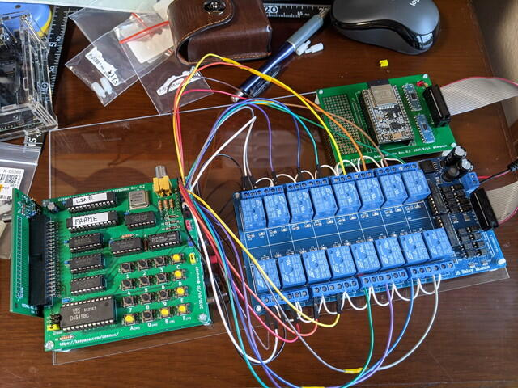
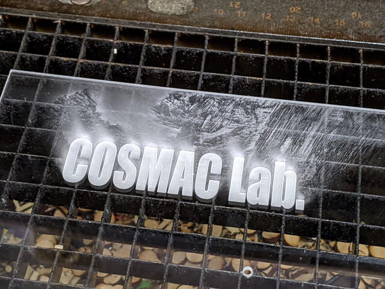

先日[COSMAC VIP OSをスマートフォンで操作](https://kanpapa.com/cosmac/blog/2020/09/cosmac-vip-os-ESP32-remote-keypad.html "     ホーム ブログ COSMAC VIP OSをスマートフォンで操作してみました   COSMAC VIP OSをスマートフォンで操作してみました")できるかを確認しましたが、リレーモジュールに接続するESP32の部分を基板にしてすっきりさせました。

ブレッドボードでもユニバーサル基板でも問題ないのですが、せっかくの[Maker Faireの出展](https://makezine.jp/event/makers-mft2020/m0029/ "COSMAC研究会")ですので見た目は重要です。

<!--more-->

しかし、このままだと3枚の基板がケーブルで引っ張られて扱いにくいですし、基板同士がぶつかってショートしてしまっては困ります。そこでアクリル板に固定することにしました。

ホームセンターで買ってきた厚さ2mmのアクリル板を採寸して、基板取り付け用の穴の位置を決めます。

アクリル板にハンドドリルで穴をあけます。

各基板を取り付け完成です。

しかし今一つ物足りません。左上に空きスペースがあるのでここにロゴマークをいれてみようと思いつきました。

私が利用している[おおたFab](https://ot-fb.com/ "おおたFab")さんにはレーザーカッターがあります。これを使って表面を薄くカットすればアクリルに彫刻をすることができます。

レーザーカッターにアクリル板をセットしてイラストレーターで作成した図面通りに彫刻していきます。

完成直後の状態です。

カットされた素材や発生するガスで白くなっていますが、ふき取るとこのように綺麗になります。（本当はアクリルを保護している紙をつけたままだと白くならないのですが、すでに剥いでしまった後だったので・・。）

再度基板を取り付けて組み立てました。ロゴマークが目を引きます。（ただし背景が白いと目立ちませんが）

これで完成です。さらにかっこよくなりました。

あとで思ったのですが、どうせレーザーカッターを使うのなら穴あけもレーザーカッターで行えば一度で作業が終わったなぁと。次回からそうします。
