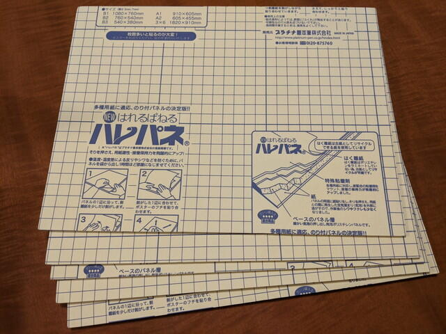
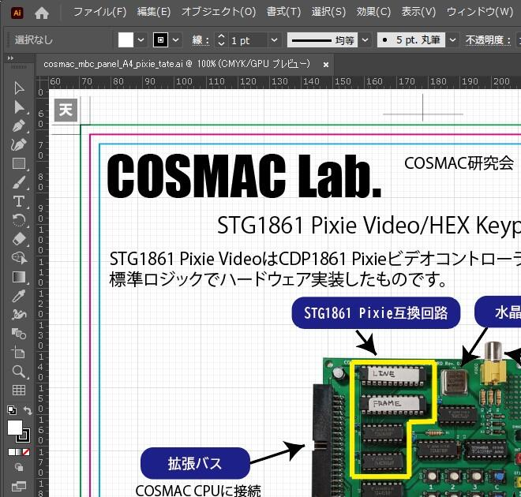

[Maker Faire Tokyo 2020](https://makezine.jp/event/mft2020/ "Maker Faire Tokyo 2020")まであと２週間を切りました。[COSMAC研究会](https://makezine.jp/event/makers-mft2020/m0029/ "COSMAC研究会")ではハードウェアやソフトウェアの準備は落ち着いたので、フライヤーやパネルといった説明資料を準備中です。

フライヤーは昨日(9/21)に発注しました。早ければ来週の頭に到着です。カラー両面200部です。去年は300部配布しましたが、今年は来場者が少ないので少し余るぐらいの部数に設定しています。

また、COVID-19対応でなるべく会話が少なくなるようにサイン、POPなどの準備をということですので、初のパネルづくりにチャレンジしています。

展示会などでよくみる小さいパネルを作ってみようと材料をさがしたところ、便利そうなのり付きパネルを見つけました。自宅のプリンタがA4しか出力できないので、A4パネルを選びました。

<!--more-->

原稿はイラストレーターで作成中です。イラストレーターの豊富な機能を使いこなすのは大変ですが、Web検索すればたいていの問題は解決しますし、便利！と感じるところも多々あります。写真切り抜きも綺麗に簡単にできます。

なかなか読むだけで伝わるパネルを作るのは難しく、この連休は内容の見直しを繰り返して、ずっとイラストレーターとにらめっこでした。まだできていないパネルもあるのですが、当日のお楽しみということで。
