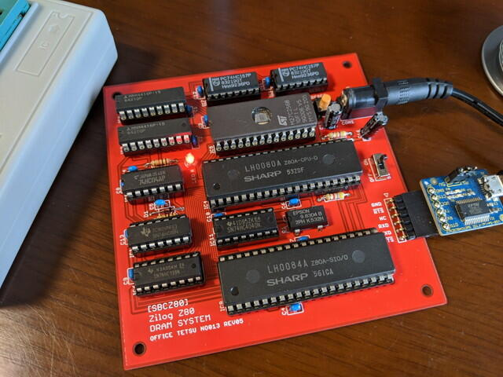
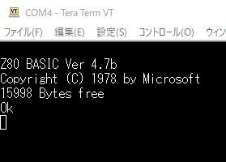

いつ出るのかと以前から話題になっていたZ80本「[ザイログZ80伝説](https://www.rutles.net/products/detail.php?product_id=858 "ザイログZ80伝説")」がついに発売になりました。

この書籍ではSBCZ80というシングルボードコンピュータが紹介されています。SBCZ80の特徴としてはDRAMとZ80 SIOを使っていることではないでしょうか。

私の手持ちのパーツを確認したところ、Z80シリーズはほぼそろっています。[オレンジピコショップさんから専用基板](https://store.shopping.yahoo.co.jp/orangepicoshop/pico-a-033.html " SBCZ80専用プリント基板")も発売になりましたので早速購入してくみたててみました。

 <!--more-->

到着した専用基板です。好きな色が選べたので燃える赤にしました。16Kx4bit DRAMはさすがに持っていなかったので合わせて購入しました。（しまった！DRAMは写真に写っていませんでした・・）

組み立て後の基板です。やはり赤基板はかっこいいです。今回はGRANTBAS.HEXをROMに焼いてみました。

シリアルポートをPCに接続して無事立ち上がっているようです。

他のROMイメージも焼いて試してみようと思います。あとはBASE-80とか動かしてみようかな。
