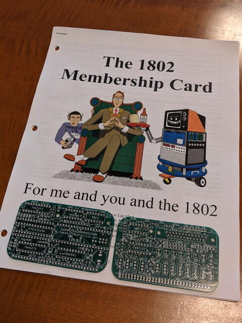
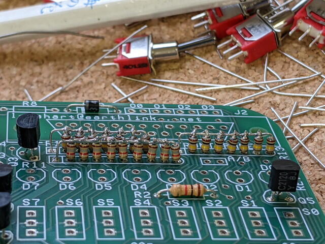
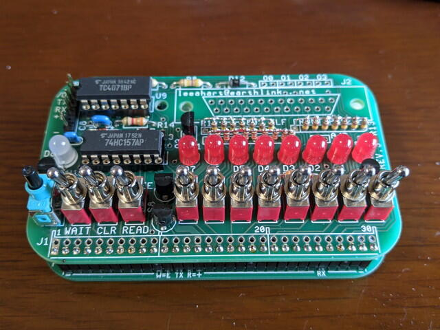
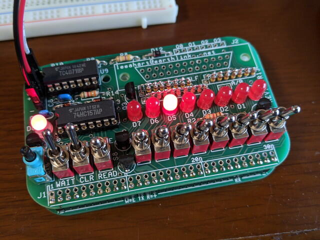

今回製作する[1802 Membership Card](http://www.sunrise-ev.com/1802.htm "1802 Membership Card")はLee Hartさんが開発したもので、海外のCOSMACファンには有名なマイコンボードです。COSMAC ELF相当の機能がコンパクトなサイズに収まっています。基板やキットが[公式サイト](http://www.sunrise-ev.com/1802.htm "1802 Membership Card")から購入できます。私の場合はMembership CardとFront Panelの２枚の基板を注文しました。

到着した基板とマニュアルです。[マニュアルも公式サイトで公開](http://www.sunrise-ev.com/MembershipCard/memberjk3.pdf "memberjk3.pdf")されています。

<!--more-->

マニュアルに掲載されているBOMを見ましたが、秋葉原では見かけない以下のパーツがありました。

- 1.8MHzセラミック発振子（4MHzとかはありますが、なかなか2MHzぐらいのものは見かけません）
- 集合抵抗（8素子や4素子の集合抵抗はよく見かけますが、ここでは7素子、9素子を使います）
- 抵抗入りトランジスタ（バイアス抵抗が22KΩでしたが、秋月電子のバイアス抵抗が10KΩのものを使いました）
- スーパーキャパシタ（5.5Vで、本​体​直​径​:​1​3​.​5​m​mの小型のものはなかなか見かけません）
- オプションの拡張メモリ CY7C199 (32KByte RAM、300mil幅)

これらをそろえるのに少し時間がかかってしまいました。私が使用したパーツをGoogleスプレッドシートに載せておきますので、作るかたは参考にしてください。

- [今回使用したパーツの一覧](https://docs.google.com/spreadsheets/d/1KTw75G3M7BMRcqsglm_oxOVt9mTYBQ7B5tbHK7y_GgA/edit?usp=sharing "1802 Membership Card部品表")（Googleスプレッドシート）

パーツが揃ったところで組み立てです。丁寧なマニュアルが付いているので組み立てはむずかしくはありません。今回は同じ素子数の集合抵抗は入手できなかったので1/6W抵抗を空中配線ではんだ付けすることで代用しました。

実装が終わった1802 Membership Card基板です。外部接続端子は30Pヘッダピンです。ここには電源、8ビットの入出力ポート、Q出力、EF1～4などの制御信号が引き出されています。なお、CPUのバスラインは引き出されていません。

トグルスイッチが実装されているFront panel基板と1802 Membership Card基板を接続するとこのようにコンパクトになります。基板はキャンディ缶のサイズになっていて、キャンディ缶がケースとして使えるのだそうです。

この1802 Membership Cardはコンフィグレーションが豊富で、各種RAM/EPROM/EEPROMに対応しています。

まずはRAMのみを実装して動かしてみることにしました。32KByteのメモリICを2つ実装できるので、64KByteアドレス空間のすべてがRAMというクリーンコンピュータになります。

RAMしかないので、プログラムのロードはフロントパネルのトグルスイッチで行います。このあたりはCOSMAC TOYで慣れているので、QのON/OFFを繰り返すプログラムでまず試しました。QのLEDが点滅しています。

ここまでで特に問題ないようなので、いつもCOSMAC TOYで動かしているカウントアップLチカを動かしてみました。

カウントアップLチカのプログラムは[GitHub](https://github.com/kanpapa/MCard1802/blob/main/countup.lst "countup.lst")にあげておきました。

次は[モニタプログラムを載せてシリアルコンソールから制御](https://kanpapa.com/cosmac/blog/2020/10/1802-membership-card-part2.html "1802 Membership Cardを作ってみました（モニタ動作編）")できるようにします。
