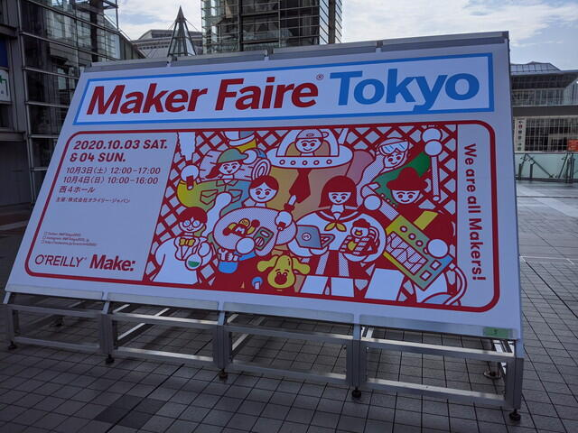
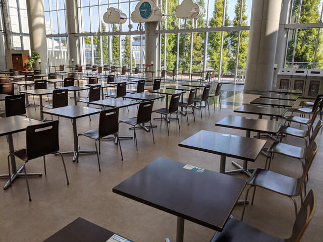
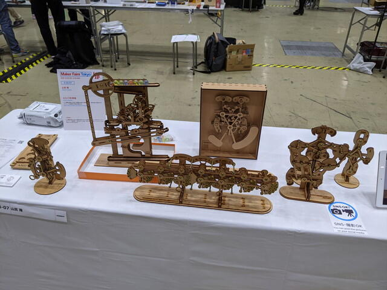
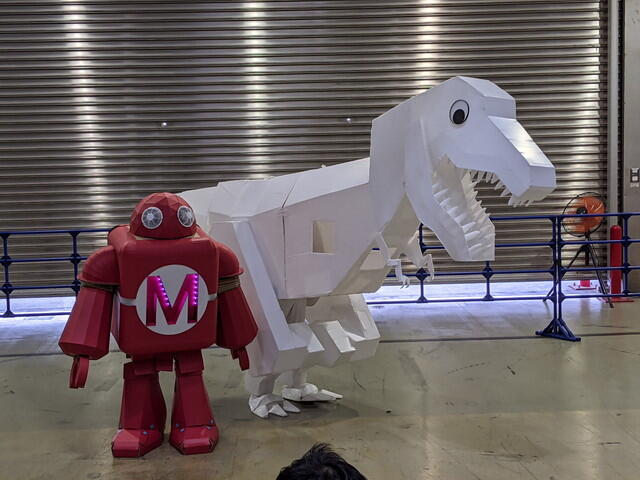
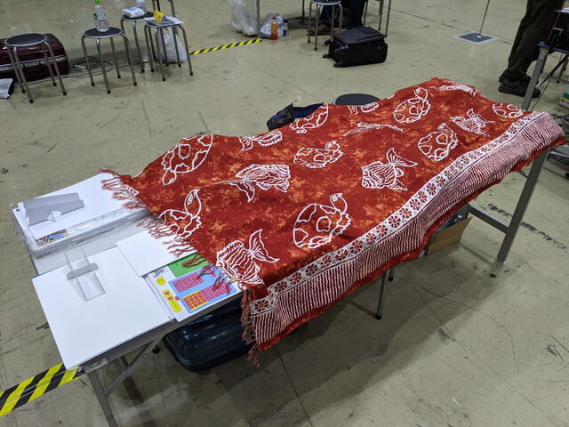

さていよいよ[Maker Faire Tokyo 2020](https://makezine.jp/event/mft2020/ "Maker Faire Tokyo 2020")の１日目です。9時から会場準備ができるのでそのころに到着するように出かけました。またまたビックサイトですが、朝なので逆光です。

<!--more-->

看板も昨日のままです。

まずは腹ごしらえということでコンビニにいきましたが、コンビニ前は完全におひとり様席になっていました。

また今日は東館ではイベントが無いようで、シャッターが閉まったままです。初めて見ました。

[Maker Faire Tokyo 2020](https://makezine.jp/event/mft2020/ "Maker Faire Tokyo 2020")会場の西４にむかうと、シロさんがお出迎え。想像よりも大きかったです。製作者のヒゲキタさんに重さや仕組みなどお話しを伺うことができました。

さて、[COSMAC研究会](https://makezine.jp/event/makers-mft2020/m0029/ "COSMAC研究会")のブースに向かい、セッテイングを行います。フライヤーの位置やパネルの位置などいろいろ試しましたが、最終的にはこのかたちで展示を行うことにしました。

左側には作業場所としてお世話になっている[おおたFab](https://ot-fb.com/ "おおたFab")さんのフライヤーと今年製作した[COSMAC研究会のフライヤー](https://kanpapa.com/cosmac/blog/2020/09/maker-faire-tokyo-2020-flyer-complete.html "Maker Faire Tokyo 2020用のフライヤーが到着しました")。中央には[スマホ接続対応のCOSMAC VIP相当のマイコンボード](https://kanpapa.com/cosmac/blog/2020/09/cosmac-vip-autowrite2vram.html "COSMAC VIPのVRAMに自動キー入力で書き込んでみました")で、右側には昨年のフライヤーと[トグルスイッチマイコンボード](https://github.com/kanpapa/cosmac_toy "トグルスイッチでCOSMACプログラミング")でLチカです。

私のブースの左隣は山宮さんの[からくり計算機](https://makezine.jp/event/makers-mft2020/m0099/ "からくり計算機")です。様々なからくり機構で計算ができます。何度も拝見していますが、おもしろいですね～。

右隣はKosakaさんの[70s自作コンピュータ](https://makezine.jp/event/makers-mft2020/m0147/ "70s自作コンピュータ")の展示です。大切に保存されていたそうです。いつか実際に動いているのをみてみたいところです。

よく見るとお二人ともテーブルの上に布を敷いていますね。このあたりは作品を見せるコツでしょうか。私も次回は参考にします。

他の展示もまわってみましたが、この日の一番のお気に入りは[菊水電子さんのレトロBluetoothスピーカー](https://www.kikusui.co.jp/addition/bsp/index "昭和レトロ計測器")。形は昔のオシロスコープですが、中身はRaspberry Pi 3A+が入っているそうなので、いろいろな使い道ができそうです。例の[コミック本](https://www.kikusui.co.jp/comic/ "マンガでわかる直流安定化電源")もありました。

あとはシロとMaker Robotが記念撮影をしていましたのでパチリ。

という感じで1日目は過ぎてしまいました。

肝心のCOSMAC研究会のブースですが、COSMACが懐かしいというかたが何人もいらっしゃいました。昔アスキーにCOSMACの記事を書いていたというかたも。持ち込んだCPU基板は1枚もらわれていきました。一番多かった質問は「COSMAC CPUは今も売っているのでしょうか？」でした。はい。今でも入手は容易です。

しかし、なかなかスマホでCOSMAC VIPを遊んでくれる人は現れません。確かに、わざわざ自分のスマホを怪しいWiFi-APにつなぐのは面倒です。残念ながら１日目はせっかく作ったスマホ対応版COSMAC VIPの出番はありませんでした。

17時になり１日目は終了です。布をかけて・・・。

また明日。

[２日目のレポート](https://kanpapa.com/cosmac/blog/2020/10/cosmacmaker-faire-tokyo-2020-day2.html "COSMAC研究会でMaker Faire Tokyo 2020に出展しました（2日目）")に続きます。
