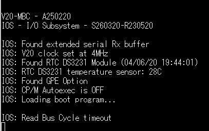
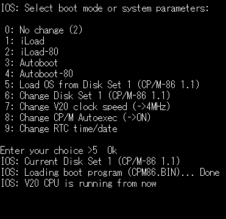

最近ずっとCOSMACばかりでしたので、@yanatokuさんからいただいたV20-MBC基板を組み立てることにしました。

説明ページは以下にあります。

- [V20-MBC: a V20 (8088 + 8080) CPU homebrew computer](https://hackaday.io/project/170924-v20-mbc-a-v20-8088-8080-cpu-homebrew-computer "V20-MBC: a V20 (8088 + 8080) CPU homebrew computer")

なお、オレンジピコショップさんでも[V20-MBC基板](https://store.shopping.yahoo.co.jp/orangepicoshop/pico-a-030.html "V20-MBC専用プリント基板")を扱っているようです。

私の場合、少しパーツが不足していたので、Maker Faire Tokyoが終わったあとに秋葉原に買い出しにいきました。

 <!--more-->

基板へのパーツの取り付けも完了し、久々にAtmel Studio 7のTools/Device ProgrammingとAVRISPmkIIでATMEGA32Aにウェブに掲載されているS260320\_R230520.ino.with\_bootloader\_atmega32\_16000000L.hexをそのまま書き込みました。FusesとLock bitを書き込むのもお忘れなく。電源はUSBシリアル基板の+5Vを使いました。

その後、手持ちのSDカードにSD-S260320-R230520-v3.zipを展開したものをそのままコピーし、SDカードモジュールにセットして基板に取り付けました。RTCモジュールも持っていたので同様に接続しました。

さて準備完了とUSBシリアルでTeraterm(115200bps)を起動したところ、"IOS: Read Bus Cycle timeout"とエラーのようなメッセージが表示され、残念ながら先にすすみません。

このメッセージを表示しているところをS260320-R230520\_IOS\_V20-MBC.zipのS260320\_R230520.inoで確認したところ、Read Bus Cycleがタイムアウトになっているようで、バスの読み込みがうまくできないようです。

このメッセージが表示されていて動かないとTweetしたところ、@yanatokuさんからSDカードの相性かもしれないとのことで、SDカードを交換したところ、BINファイルを読み込み、少し進んだようですが、結局無反応になってしまいました。

USERスイッチを押したままリセットを行うと、再度Bootモード選択メニューが表示されるので、5番のLoad OS from Disk Set 1を選んでみましたが、結局同じ状況でハングアップしてしまいます。

そういえば、V20 CPUは以前Aliexpressで買ったことがあるなと思い出して探したところ、なんと10個もでてきたので、そのうちの1個に差し替えてみました。

電源を再び投入すると、CP/M-80が何事もなかったように起動するではありませんか。

CP/M-86に切り替えても問題なく動きます。

結局、最初に使用していたCPUが正常では無かったようです。また、SDカードを最初のものに差し替えても問題なく動作しましたので、SDカードの相性でもなかったようです。

やはり再生品のCPUを使う場合は、故障を前提としてある程度の数を買っておくのがいいですね。今回はV20を買っていたので助かりました。

80系と86系を動かせるのがV20の面白いところです。久々のCP/Mなのでゆっくり遊んでみようと思います。
