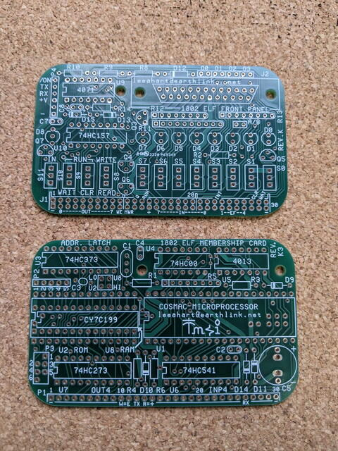
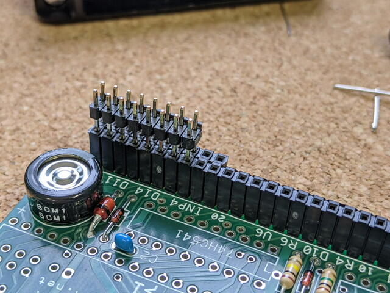
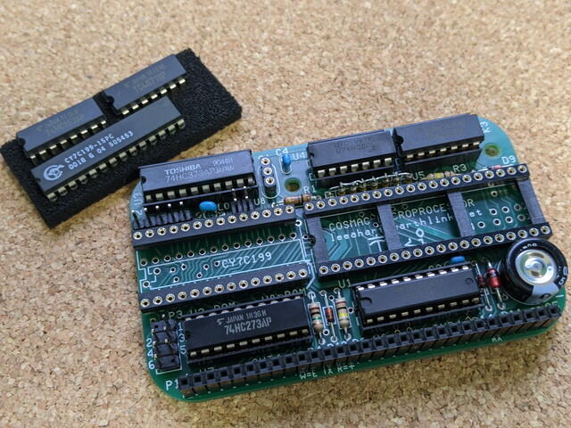
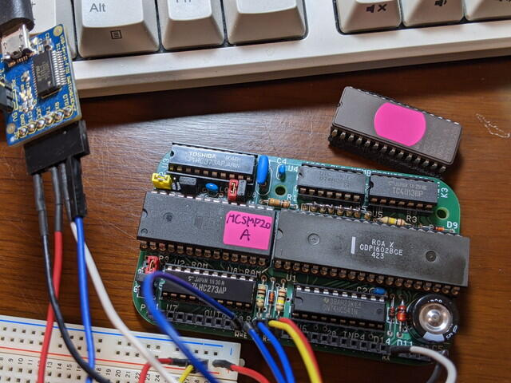

少し前にオーダーしていた[1802 Membership Card](http://www.sunrise-ev.com/1802.htm "1802 Membership Card")の基板が届きました。

すでに[1台めは完成して問題なく動作](https://kanpapa.com/cosmac/blog/2020/10/1802-membership-card-part2.html "1802 Membership Cardを作ってみました（モニタ動作編）")しているのですが、もう1台実験用として使うために購入しました。あと自作回路も実装したくプロトタイプ基板も2枚購入しました。プロトタイプ基板にはピンソケットとピンヘッダも付属していて、本来使うピンソケットの形を確認することができました。

<!--more-->

前回同様に組み立てていきます。

SIP抵抗はまた手作りです。

1台めと変更した点ですが、今後[Olduino](https://olduino.wordpress.com/about-2/about/ " About the 1802 Olduino")を試してみたいのでメスコネクタを使用しています。Olduinoは標準では引き出されていない信号を使うため、2列のピンヘッダが実装できるように仮組みしてはんだ付けしました。

ほぼ実装が完了した2台めの1802 Membership Cardです。ここではRAMははんだ付けしていませんが、RAMが正常かチェックをするのを忘れたので確認後にはんだ付けすることにしました。

RAMが正常なことを確認してはんだ付けを行いました。あとはCPUとモニタROMを取り付けて完成です。

Membership Card単体で動作確認をおこなうため、MCSMP20A.binをEEPROMに書き込みました。USBシリアルをコネクタに接続し、問題なくモニタが動くことを確認しました。

Frontpanelは特に急いでいないので、今後実装したいと思います。
