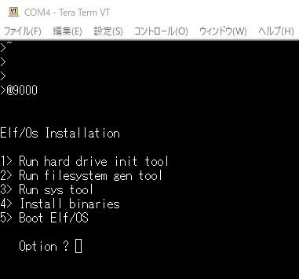
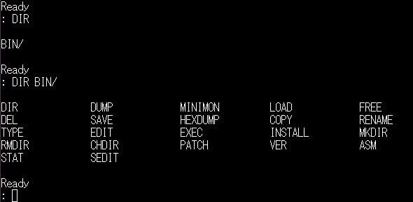

前回は[Pico/Elf V2の動作確認](https://kanpapa.com/cosmac/blog/2020/11/cosmac-elfos-picoelfv2-part1.html "COSMACでElf/OSを動かしてみました（Pico/Elf V2製作編）")までおこないましたが、[Elf/OS](http://www.elf-emulation.com/elfos.html "Elf/OS")を動かすために注文していたIDE-CF変換基板が到着しました。IDE側は40Pコネクタです。

このIDE-CF変換基板の電源は手前のフロッピィドライブ用の電源コネクタに接続する必要があります。+5Vが必要です。私の場合はオリジナルの電源ケーブルを製作しました。

準備ができたところで、IDE-CF変換基板をPico/Elf V2のIDEインタフェースに接続して、Elf/OSを動かしてみます。まずは、IDE-CF変換基板をPico/Elf V2に取り付けます。今回は32MBのCFカードを使いました。ROMもDiskless版からElf/OSインストールパッケージ版に差し替えました。

この状態で電源をいれ、シリアルコンソールでEnterをしたところ > のプロンプトが表示されました。一応動作しているようです。続けて @9000と入力して、Elf/OSのインストーラーを起動します。

番号にしたがって順番に設定を進めていきます。まずはCFカードの初期化です。初期化しているセクタ番号がカウントアップしていきます。少し時間がかかります。

CFカードの初期化ができたようですので、ファイルシステムの作成を行います。

これで、ファイルシステムができました。次はシステムのコピーです。

ここはSystem Copied.という表示だけです。エラー表示はなく問題なさそうです。

次はバイナリのコピーです。

続けてインストールしていきます。

バイナリファイルのインストールも終わりました。

いよいよElf/OSを起動します。

正常にElf/OSが起動できたようです。試しにDIRコマンドを入力してみます。

BINというディレクトリの中に先ほどインストールしたコマンド群が見えます。

CP/Mに近い感覚です。一通りのファイル操作コマンドやエディタ、アセンブラ、モニタ、ダンプなど開発ツールもあるようです。

無事Elf/OSが動いたので、これから探検してみようと思います。
