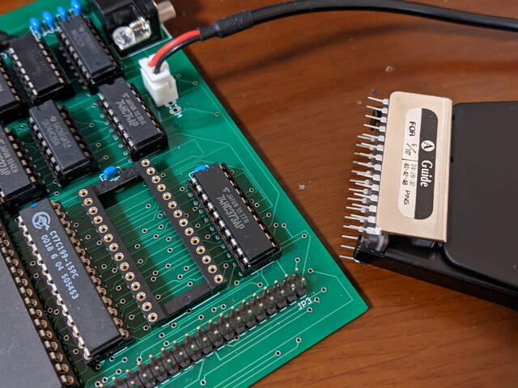

最近ROMの周りが密集した基板を扱うことが多くなりました。ROMを外すときにいつも使っている小さいドライバーが差し込みにくく、下手をすると周りのピンヘッダが曲がったり、ICの足が曲がりそうになるなど恐る恐るの作業が増えています。

Twitterで「ICの引き抜き器でおすすめがあれば教えてください。」とツイートしたところ、サンハヤトのDIP IC EXTRACTOR 引き抜き治具 GX-7が良いと教えていただきました。

この工具の存在は知っていましたが、そこまで必要はないだろうと考えていたので購入は見送っていたのですが、思い切って買ってみました。

到着したGX-7です。

持ち手にあるラベルを見るとどのDIP ICにどの治具が適合するかが書かれています。こういう点は親切ですね。

実際に基板から27C256 EPROMを治具を使って抜いたところ、むちゃくちゃ楽に外せました。

この基板の場合、ROMの近くにピンヘッダがあります。こちら側からドライバーを差し込もうとするとピンヘッダが曲がってしまいますが、そういう心配が全くなくなりました。もっと早く買っておけばよかったです。
