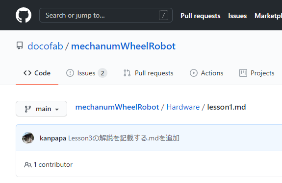

[OSOYOOさんのメカナムロボット](https://osoyoo.com/2019/11/08/omni-direction-mecanum-wheel-robotic-kit-v1/ "Metal Chassis Mecanum Wheel Robotic (for Arduino Mega2560) Introduction (Model ZZ012318MC)")では５つのLessonがあり、それぞれにArduinoのプログラムが用意されています。

まずはLesson1のプログラムを読んでみますが、このプログラムのライセンスがどうなっているのかが気になりました。[おおたFab](https://ot-fb.com "おおたFab")の「素人でもロボットをつくりたい」に参加されているかたとGitHubで共有しながら必要に応じてソースコードを改変して実験してみたかったのです。

OSOYOOさんでは[GitHub](https://GitHub.com/osoyoo "osoyoo")にソースコードを登録しているのですが、今回のメカナムロボットのソースコードは登録されていないようです。また、GitHubにおいても、ライセンスは明記されていません。マニュアルにはオープンソースと書かれていますが、念の為OSOYOOさんに、プログラムのライセンスを確認してみました。

メールをだしたところ、すぐ返事をいただけました。

- GitHubに登録しているソースコードはApacheライセンスに基づくOSSです。
- メカナムロボットのソースコードはGitHubに登録していませんが、Apacheライセンスに基づくOSSです。
- コンテンツにOSOYOOの名前が記載されている限り、ブログまたはGitHubを使用して公開できます。

ライセンスがはっきりしたことで、メカナムロボットのサンプルプログラムをGitHubに登録することができました。

まずはLesson1のソースを読んで基本的なモーター制御の部分をGitHubにまとめました。

- [https://github.com/docofab/mechanumWheelRobot/blob/main/Hardware/lesson1.md](https://github.com/docofab/mechanumWheelRobot/blob/main/Hardware/lesson1.md "lesson1.md")

ここまでは非常にシンプルな構造なので理解は容易です。

次は[Lesson2のソースを読んでみます。](https://kanpapa.com/2020/12/mecanum-wheel-robot-github-lesson2-hc-sr04.html.html "メカナムロボットのLesson2で使っている超音波センサーを動かしてみました。")
