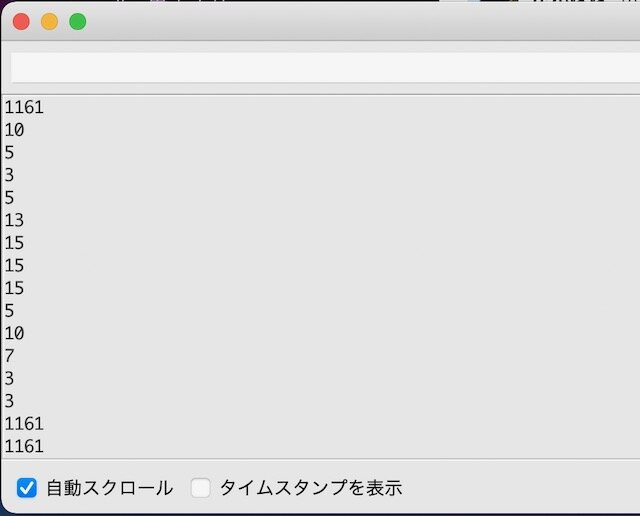
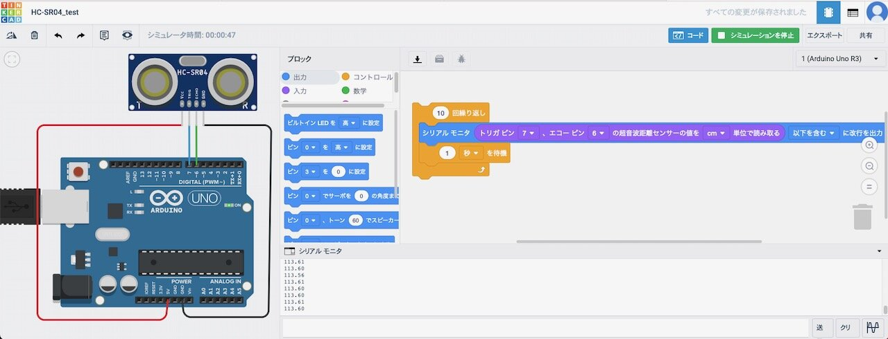

[OSOYOOさんのメカナムロボット](https://osoyoo.com/2019/11/08/omni-direction-mecanum-wheel-robotic-kit-v1/ "Metal Chassis Mecanum Wheel Robotic (for Arduino Mega2560) Introduction (Model ZZ012318MC)")のLesson2では超音波センサーとサーボーモーターを使ったプログラムになっています。

こちらもGitHubにまとめ始めていますが、まだ途中です。

- [https://github.com/docofab/mechanumWheelRobot/blob/main/Hardware/lesson2.md](https://github.com/docofab/mechanumWheelRobot/blob/main/Hardware/lesson2.md "lesson2.md")

### 超音波センサーを試してみる

ちょうど同じ超音波センサーを持っていたので、Lesson2のソースコードを参考にしてArduinoに接続してみました。

 <!--more-->

シリアルモニタに超音波センサーから出力された距離の情報が出力されました。



今回作成したテストプログラムとfritzingで作成した実体配線図もGitHubに登録しています。

- [HC-SR04\_test.ino](https://github.com/docofab/mechanumWheelRobot/blob/main/Arduino/Samples/HC-SR04_test/HC-SR04_test.ino "HC-SR04_test.ino")
- [HC-SR04\_fritzing.jpg](https://github.com/docofab/mechanumWheelRobot/blob/main/Arduino/Samples/HC-SR04_test/HC-SR04_fritzing.jpg "HC-SR04_fritzing.jpg")

### Thinkercadでシミュレートしてみる

[Thinkercad](https://www.tinkercad.com/ "Thinkercad")でも同様に実体配線図が書けると聞いたので、こちらでも試してみました。

Thinkercadではブロックでプログラムを書けるようなので試してみたところ超音波センサー専用のブロックがあり、これを使うと同様なArduinoプログラムを生成することができ、おまけにシミュレートまでできるようです。



今回Thinkercadで生成されたArduinoプログラムです。コメントもついてきれいなソースです。

```
int distance = 0;

long readUltrasonicDistance(int triggerPin, int echoPin)
{
  pinMode(triggerPin, OUTPUT);  // Clear the trigger
  digitalWrite(triggerPin, LOW);
  delayMicroseconds(2);
  // Sets the trigger pin to HIGH state for 10 microseconds
  digitalWrite(triggerPin, HIGH);
  delayMicroseconds(10);
  digitalWrite(triggerPin, LOW);
  pinMode(echoPin, INPUT);
  // Reads the echo pin, and returns the sound wave travel time in microseconds
  return pulseIn(echoPin, HIGH);
}

int counter;

void setup()
{
  Serial.begin(9600);

}

void loop()
{
  for (counter = 0; counter < 10; ++counter) {
    Serial.println(0.01723 * readUltrasonicDistance(7, 6));
    delay(1000); // Wait for 1000 millisecond(s)
  }
}

```

Thinkercadを使って、メカナムロボットのプログラムを作ってみるのも理解しやすく面白いかもしれません。

次はLesson2のサーボモーターのところを見ていきます。
