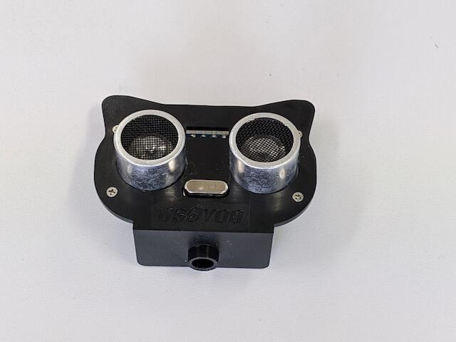
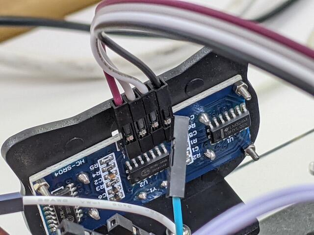

[前回でメカナムロボットのLesson 1](https://kanpapa.com/2020/12/mecanum-wheel-robot-part2.html "メカナムロボットの試運転を行いました（おおたFab 第34回 素人でもロボットをつくりたい）")が終わりました。今回はLesson 2として超音波距離センサーを取り付けて障害物を回避して動くようにします。

超音波距離センサーを組み立てます。まず、ネコの顔の形をしたプラスチックに固定します。

この超音波距離センサーはよく見かけるもので秋月電子でも販売されています。

- [超音波距離センサー HC-SR04 \[M-11009\]](https://akizukidenshi.com/ "超音波距離センサー HC-SR04")

<!--more-->

次にサーボモーターのケーブルをモータードライバに接続し、先程の超音波距離センサーをサーボモーターにネジで仮止めします。これでArduinoでサーボモーターを制御することでセンサーの方向が変更できます。

センサーに４本の電線（Vcc, TRIG, ECHO, GND）を接続します。

まずは電源ラインのVccとGNDを接続します。

次にTRIGとECHOをArduinoの30ピン, 31ピンに接続します。

これで配線は完了です。次にテストプログラムをArduino MEGAに書き込みます。

このテストプログラムはセンサーの位置決めをする機能も入っていて、起動後に左右にセンサーを動かし正面で止まるようになっているので、正面の位置を合わせてサーボモーターにねじ止めします。

超音波センサーの取り付けが終わったメカナムロボットはこのようになりました。

テストプログラムで実際に動かしたところをYouTubeにアップしておきました。

少し不安がある動きをしているように見えます。この時点ではハードウェアに問題があるのかソフトウェアに問題があるのかわかりません。目視ではハードウェアには問題はないように見えたので、次回はArduinoのプログラムを読んでソフトウェアの動作を理解することにします。
