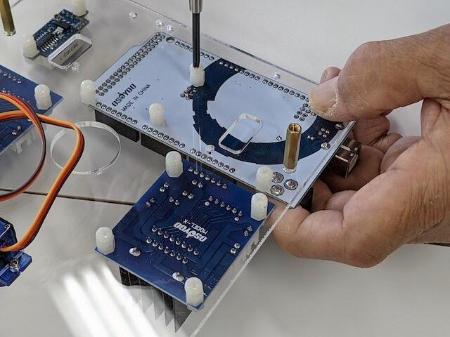
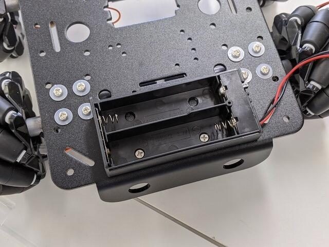

[前回はメカナムロボットのシャーシ部分の組み立て](https://kanpapa.com/2020/11/mecanum-wheel-robot-part1.html "メカナムロボットを組み立ててみました（おおたFab 第33回 素人でもロボットをつくりたい）")を行いました。今回はシャーシにモータードライバやマイコンボードを取り付けて実際に動かしてみます。[OSOYOOのマニュアルのLesson 1の後半](https://osoyoo.com/2019/11/08/metal-chassis-mecanum-wheel-robotic-for-arduino-mega2560-lesson1-robot-car-assembly/ "Lesson1: Robot car assembly")になります。

まずベースとなる透明なアクリル板にマイコン基板(Arduino Mega)やモータードライバ基板を取り付けます。モータードライバ基板は２枚あり、１枚は左側の２つのモーターに、もう１枚は右側の２つのモーターに接続します。3桁の7セグメントLEDが見えますが、これは電圧計でした。搭載するバッテリーの電圧を常に表示しています。

アクリル板の取り付け穴の位置を確認したところ、基板とアクリル版の穴位置は合っていても、付属のプラスチックネジやプラスチックナットが大きすぎて、基板のコネクタにあたって取り付けられないところがいくつかありました。他のネジで固定されているので問題はなかったのですが、やや不安がある設計だと感じました。

<!--more-->

ネジの取り付けができない部分を除いて、ベースとなるアクリル板のネジ穴に合わせてネジ締めです。

次に電池ボックスをシャーシに取り付けようとしたのですが、ネジの頭が小さく、電池ボックスをうまく固定できません。ネジでの固定ではなく両面テープで貼り付けることにしました。

このようにマニュアル通りに組み立てができなくても、アイデアで解決していくのがこのキットの醍醐味かもしれません。

先程のアクリルベースを金属製のスペーサーを挟んでシャーシにとりつけます。

次にシャーシの裏側に取り付けているモーターの配線を中央の穴をつかって引き出します。

モーターへのケーブルをモータードライバ基板に接続し、さらに付属のケーブルで基板間を接続していきます。

配線が終わったところで、Arduino MegaにUSBケーブルを接続し、PCのArduino IDEからサンプルスケッチのlesson1.inoを書き込みます。

さていよいよ試運転です。どのくらいの範囲で動くか分からないので、床に置いて電源を入れました。

無事モーターが回転し、さまざまな動きをしてくれました。動画をYouTubeにアップしておきました。

ちょっと床がピカピカで空回りもしていますが、今のところ動作は特に問題ないようです。無事一発で動いてくれました。

今回完成したメカナムホイールロボットです。

まだセンサーは接続しておらずプログラムで指定した通りに動くだけですが、今後センサーを取り付けて本格的なロボットに仕上げていきます。
