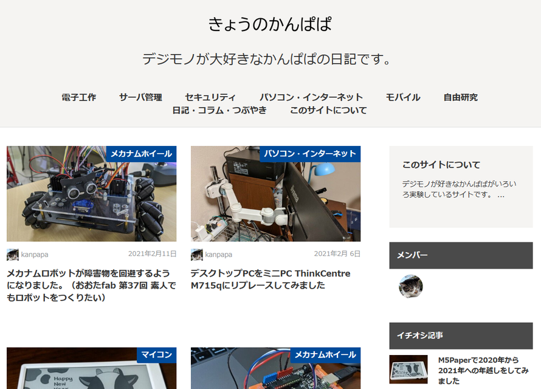

このサイトのMovableTypeのブログテーマを[Rimo](https://github.com/movabletype/mt-theme-rimo/wiki "Rimo documents wiki")に変更してみました。今どきのオウンドメディアサイトでスクロールするとコンテンツがどんどん表示されるものです。

 <!--more-->

テーマをRimoに変更したことで、Google Search Consoleでモバイルユーザビリティの改善が確認できました。

さらに[Markup Validation Service](http://validator.w3.org/ "The W3C Markup Validation Service")や[W3C Link Checker](http://validator.w3.org/checklink "W3C Link Checker")、[CSS Validation Service](https://jigsaw.w3.org/css-validator/)などでサイトのコンテンツを確認しましたが、CSSチェックで間違いがみつかり、なんだろうと思ったらテーマRimoのstylesheetが間違っているようなので、[プルリク](https://github.com/movabletype/mt-theme-rimo/pull/22 "fixed img #22")しておきました。

あと、[hatenaフォトライフの写真](https://f.hatena.ne.jp/kanpapa/ "kanpapa's fotolife")を使っている記事だと、サイトのインデックスで画像が表示されないため、画像をサイト内に移動してリンクを張りなおすなどの修正もおこないました。

カテゴリも階層化して大幅に整理しました。

これで一通りのリニューアルが完了したと思いますが、写真が無い記事にはなるべく写真をいれるなど、コツコツかっこ良くしていきたいと思います。
