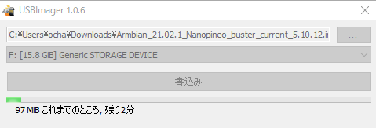
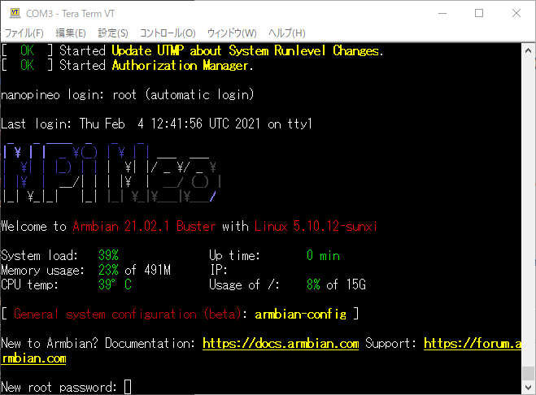
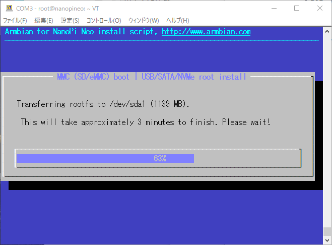
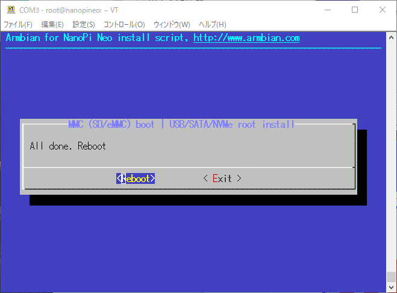

### Nano Pi NEO自宅サーバがクラッシュ

4cm角のマイコン[Nano Pi NEO \[M-12301\]](https://akizukidenshi.com/ "Nano Pi NEO")を使った[自宅Linuxサーバ](https://kanpapa.com/2018/09/armbian-nano-pi-neo-nas-ssd.html "armbianでNano Pi NEO NASをSSDベースのサーバにしてみた")を2018年9月から稼働しています。これまで全くトラブルもなく連続稼働していたのですが、昨日rebootしたところ起動しなくなってしまいました。

久しぶりにケースを開けて、3.3Vのシリアルコンソールを接続したところ、ファイルシステムが壊れていてbootの途中でpanicになっていました。


### Armbianの再インストール

やむをえずArmbianの再インストールを行うことにしました。[Armbianの公式サイト](https://www.armbian.com/ "Armbian")をみたところ、今はLinuxカーネルV5.10を使用した[Armbian Buster](https://www.armbian.com/nanopi-neo/ "Armbian Nano Pi Neo / Core")(Debian 10.8)が最新のようですので、これを新規インストールすることにします。

まずはNano Pi NEOからmicroSDカードを抜いて、Armbian Busterのイメージを[USBImager](https://gitlab.com/bztsrc/usbimager "USBImager")で書き込みます。



書き込みが終わったmicroSDカードをNano Pi NEOに取り付けて電源をいれたところ無事起動しました。Nano Pi NEOには問題はなさそうです。



このあとrootのパスワード設定とユーザ登録が自動的に行われます。親切な設計だと思います。

### 起動ディスクをSSDに変更

SDカードからArmbianを起動すると、ルートディレクトリはmicroSDカード上に作られます。この状態で連続稼働させるのはやや不安がのこります。Armbianでは外付けのSSDやHDDにシステムファイルをインストールすることができます。

私のサーバは[Nano Pi NEO NASキット](https://kanpapa.com/2017/11/nano-pi-nas-case-kit.html "Nano Pi NEO用NASケースキットを組み立ててみた")で、64GB SSDをSATA - USB接続しているので、これにシステムファイルをインストールします。以下のコマンドを入力します。

```
nand-sata-install
```

次のような画面が現れます。BootはmicroSDカード、SystemはSSDにインストールしたいので、そのままOKを押します。


SSDにファイルシステムが作成されて、システムファイルのコピーが始まります。



Rebootの指示がでるのでRebootします。



再起動後にファイルシステムの状態を確認すると、ルートファイルシステムはSSDになっていることがわかります。


これでmicroSDカードはBootの時しか使われなくなります。

### Armbianの設定

ネットワークやTIMEZONEなど主要な設定は

[`armbian-config`](https://docs.armbian.com/User-Guide_Armbian-Config/ "armbian-config")

で簡単におこなえます。

私の場合はIPを固定にして、ルーターのポートフォワードでインターネットからアクセスできるようにしています。

ネットワークが正常に接続できたら、まずはアップデートを行うことをお忘れなく。

```
apt update
apt upgrade
```

### Mackerelの設定

私はこの自宅サーバの監視に[Mackerel](https://mackerel.io/ "Mackerel")の無料枠を利用しています。

具体的な設定方法はRaspberry Piの監視と同じなので以下のQiitaの記事を参照してください。

- [Raspberry Pi を Mackerel で監視する](https://qiita.com/ww24/items/5409aefd87f14beff504 "Raspberry Pi を Mackerel で監視する")

Monitorsが無事グリーンになって監視が始まりました。


またサーバ監視以外にも自宅ネットワークがおかしくなったときもMackerelからアラートが飛んでくるので気がつきます。

### アプリケーションの起動確認

あとはこのサーバで動かしているアプリケーションをバックアップからリストアします。なお、ログは同じネットワーク上のNAS（QNAP）のsyslogサーバに転送しているので保全されています。

### 無事完了

一通りの作業が完了したら、一度シャットダウンして、もとのケースに戻します。


これで無事自宅サーバが復旧しました。

こんな小さなサーバでもバックアップは重要です。いざという時のためにUSBメモリなどに重要なファイルをバックアップしておくとよいと思います。
