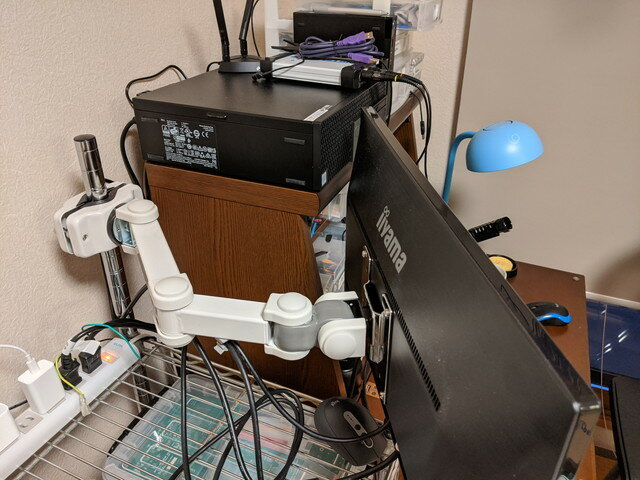
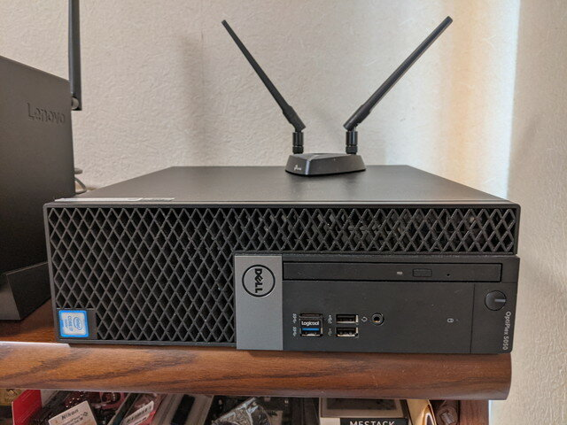
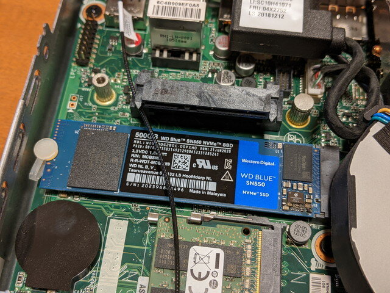
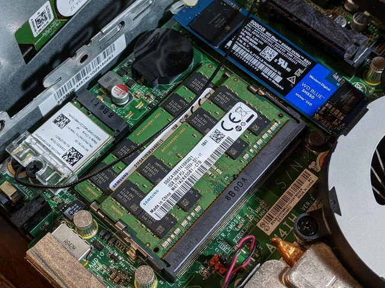

最近在宅勤務が続いていて狭い机の周りをどう広く使うかを工夫しています。

ディスプレイの置き場がないので、モニタアームを使ったり、キーボードをワイヤレスで小さいものに変えたりなどしています。

 <!--more-->

先日[M1のMacbook Air](https://kanpapa.com/2020/11/m1-macbook-air-2020-arduino-ide.html "M1 MacBook Air 2020 でArduino IDEを動かしてみました")を買ったのでたいていの作業はそちらで行うようになりましたが、Windows PCでないと動かないものもあります。そのためデスクトップは手放せません。これまではDELL Optiplex 5050 (Core i7 6700, 24GB RAM, 500GB SSD)を使っていました。

でも、あまり場所を取らずに小さいものにしたいなとヤフオクでLenovo ThinkCentre M715qを購入しました。外観はこんな感じです。（左側は以前からあるサブ機ThinkCentre M73 Core i3-4130Tです。）

このThinkCentre M715qはCPUはRyzen 5 PRO 2400GEでメモリは16GB、SSDは128GBという標準的な構成です。無線LANも内蔵なのでコンパクトに収まります。

とはいえ、現在のデスクトップPC程度の容量は確保したかったので、SSDを512GBに交換しました。

ついでに空きメモリスロットに16GBを追加して32GBのフル実装となりました。

これまで使っていたデスクトップPCよりスペックは良くなったかもしれません。

しばらくはこの構成で過ごせそうです。ミニPCはおすすめです。
