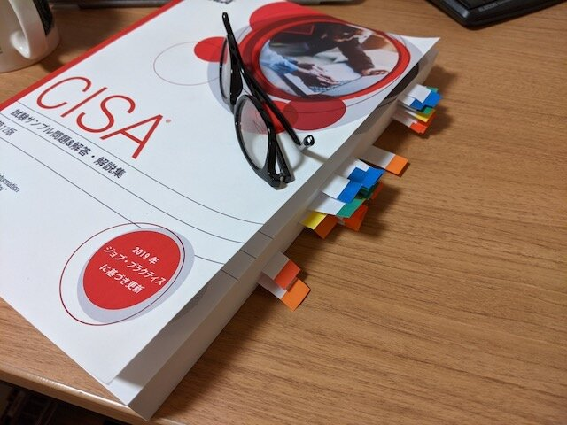
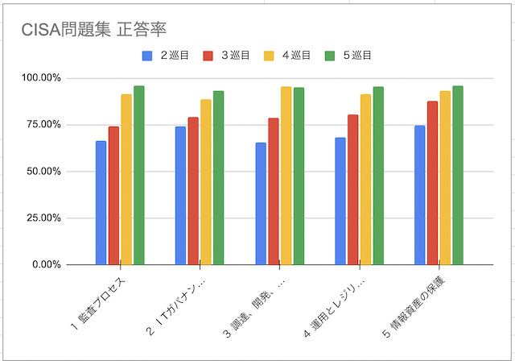
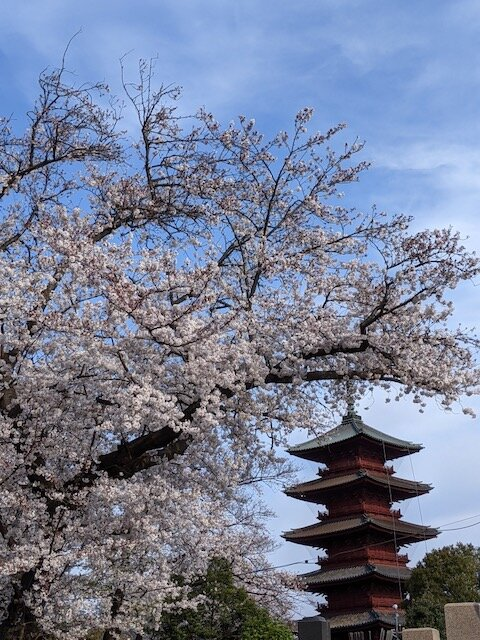
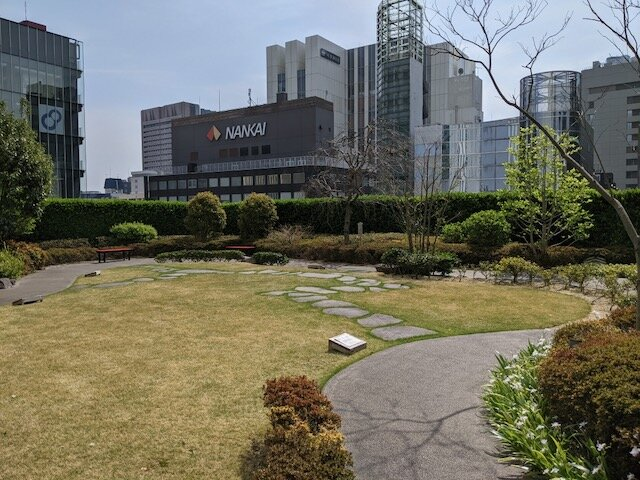

[これまで準備してきたCISA](https://kanpapa.com/2020/12/challenge-CISA-exam.html "CISAにチャレンジしてみることにしました")の試験を受けました。結果は合格だったようです。正式な合格通知も10日後にメールで届きました。

せっかくなのでCISAの受験準備をどう取り組んできたかを記録しておきます。試験内容についてはNDAがありますのでここでは触れません。

## レビューマニュアルと問題集を購入

CISA試験の参考書はISACA BOOK STOREで販売されています。私は以下の２冊の日本語版を購入しました。

- [CISA Review Manual, 27th Edition](https://www.isaca.org/bookstore/cisa-exam-resources/crm27ed "CISA Review Manual, 27th Edition") (Japanese)
- [CISA Review Questions, Answers & Explanations Manual, 12th Edition](https://www.isaca.org/bookstore/cisa-exam-resources/qae12ed "CISA Review Questions, Answers & Explanations Manual, 12th Edition") (Japanese)

購入したものはアメリカからUPSで届きました。日本語版であっても国内では販売されていません。送料が高くなりますがやむをえません。

レビューマニュアルは翻訳本で、やや日本語が読みづらいことと、ボリュームも多いのでざっと目を通す程度にし、問題集でわからない用語などの辞書代わりに使うことにしました。

問題集もかなりの厚さがあり1000問が掲載されています。これを中心に取り組むことにしました。

<!--more-->

## 試験の申し込み

[CISSPの時](https://kanpapa.com/2019/12/cissp-exam-pass.html "CISSPの試験に合格するまで")と同様に最初に試験の予約を行いました。３か月ぐらい先でいいかなと３月末にしました。４月になると環境にも変化があるかもしれませんので、なるべく年度末までに取得しようということで決めました。

## 学習の進め方

問題集は5ドメインで1000問が掲載されています。ドメインは以下の通りです。

1. 情報システムの監査プロセス
2. ITガバナンスとITマネジメント
3. 情報システムの調達、開発、導入
4. 情報システムの運用とビジネスレジリエンス
5. 情報資産の保護

この1000問を次の手順でひたすら解いていきます。

1. 問題のすぐ下に回答と解説が書いてあるので、黒い画用紙を当てて回答を隠しながら解きます。
2. 間違ったところには付箋紙を貼って、間違えた問題であることが分かるようにします。
3. 各ドメインごとに間違った問題数を数えて記録します。これで苦手なドメインがわかるはずです。
4. 今度は間違えた問題だけを解いて、問題で詰まったところや聞いたことがないキーワードはレビューマニュアルやインターネットで調べて、考え方を理解すると同時にOneNoteにポイントをまとめていきます。OneNoteにいれておくと時間のあるときにスマホで眺めて復習することもできますので便利です。
5. 間違えた問題の見直しが終わったら、付箋紙を全部はずして、1000問を最初から取り組みます。

平日は毎朝6:30から1時間、休日は午前と午後にそれぞれ2時間ぐらい取り組みました。数はこなしていますが、単なる暗記では通用しません。CISSPの時と同様に考えかたを理解する必要があります。

私の場合はこれを５回繰り返し、だんだん正答数が増えてきました。進捗を可視化することで自信につながります。

## 模擬問題をやってみる

試験の数日前に問題集の最後にある模擬問題をやってみました。150問の問題が並んでいます。CISSPの試験準備のときと同様に[BOOX](https://kanpapa.com/2020/04/boox-nova-pro-memopad.html "BOOX Nova Pro 電子ペーパータブレットで思いっきりメモ書きをしてみた")の方眼紙に回答を書いて、150問を解いた後に答え合わせをします。

このときは150問中5問が誤答でした。誤答についてはこれまで同様に見直しです。ただし、模擬問題はこの問題集に書かれているものばかりなので実際の試験ではここまでは取れないでしょう。90分ぐらいで終わったので実際の試験でも時間的な余裕があることは確認できました。これである程度の自信はついたかなと思います。

## ランダムにピックアップした問題をやってみる。

前日には娘に問題集に適当に付箋紙を貼ってもらい、その問題に取り組みました。ほぼ正答でしたが、やはり誤答はいくつかありましたので、これまで同様に見直しました。

## 試験当日

もうここまでやったので、あとはOneNoteに書いたメモを見直す程度です。ちょうど桜も咲いていたので朝一でお散歩してリフレッシュしたあとに試験会場に向かいました。

試験会場は東銀座の歌舞伎座タワーにある[銀座CBTS歌舞伎座テストセンター](https://cbt-s.com/kabukiza-tc/ "銀座CBTS歌舞伎座テストセンター")でした。開館は10:00、試験は10:30から4時間とのことなので、10:00過ぎに到着するように出かけました。受付を行って、「すぐ始めますか？」と聞かれたので、定刻前ですが試験を開始しました。

まずは150問一気に回答します。不安なものにはマークを付けておくことができます。一巡にかかった時間は2時間ぐらいでしょうか。

そのあともう一度見直しです。およそ1時間で150問を見直しましたが、問題を読み直すとこれじゃないなというものもいくつかあり回答を変更しました。これが吉とでるか凶とでるかはわかりませんが、慎重に見直しました。

この時点で残り時間は1時間はあったのですが、もう一度見てもあまり変化はないだろうということで、思い切って試験終了のボタンを押しました。

このあと簡単なアンケートがあり、最後の画面に「合格」と表示されていました。（見間違えではないと思います。）

とにかく試験は疲れました。いつもは肩が凝らないのですが、緊張していたためか試験中に何度か肩を動かさないと厳しかったです。

試験会場の近くに屋上庭園があったので椅子に座ってのんびり休憩したあとに、帰路につきました。

あとは結果通知のメールを待つのみです。→2021/4/6に正式な合格通知がきました。

## 終わりに

CISAの学習でシステム監査のより深い知見を得ることができました。被監査人となったときの経験を振り返ってみると監査人はこういう考え方で監査していたのかと納得することもできました。

この記事がこれからCISAを受験されるかたの何かのヒントになればとうれしいです。

CISA受験の背中を押してくれた同僚の皆様、Facebookでコメントをいただいた皆様、試験の準備に協力いただいた家族、すべての皆様に感謝です。
