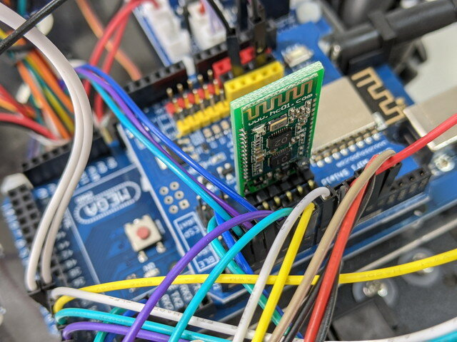

[おおたfab](https://ot-fb.com/ "おおたfab")さんのセミナー「素人でもロボットをつくりたい」では、[OSOYOOさんのメカナムロボット](https://osoyoo.com/2019/11/08/omni-direction-mecanum-wheel-robotic-kit-v1/ "Metal Chassis Mecanum Wheel Robotic (for Arduino Mega2560) ")を素材にして実験をしています。

今回はメカナムロボットをスマートフォンで制御してみようという回です。スマートフォンの接続方法はBluetoothとWiFiの２種類です。

<!--more-->

### Bluetoothで制御する

まずはBluetoothでの接続です。OSOYOOさんは[スマートフォン用のアプリ](https://apps.apple.com/jp/app/osoyoo-imitation-driving-car/id1459550861 "Osoyoo Imitation Driving Ca‪r")も提供していて、Apple StoreもしくはGoogle Playからダウンロードできます。これを使って制御を行います。

ハードウェアの準備として、メカナムにBluetoothのモジュールを取り付けて、Arduino Megaとシリアル通信ができるように配線します。垂直に刺さっている基板がBluetoothのモジュールです。

プログラムはシンプルにできていて、Bluetoothモジュールから送られてくるコマンドを読み取り、これまでと同様にモーターを制御する関数を実行することを繰り返すようになっています。通信まわりの難しいところはBluetoothモジュールに任せているようです。

実際に動かしてみた動画です。

### WiFiで制御する

WiFiもBluetoothと同様の仕組みで、WiFiモジュールをシリアル接続して利用します。このWiFiモジュールはESP系のモジュールのようで、OSOYOOさんから提供されている専用のArduinoライブラリを読み込んでおく必要があります。ESP系のモジュールはすでにArduino Megaに実装した基板にありますので、配線を行うだけです。

WiFiは２通りの接続方法があります。まずはメカナムホイールロボットがWiFiのアクセスポイントとして動作し、スマートフォンから直接接続する方式（APモード）です。もう一つはメカナムホイールロボットがWiFiのアクセスポイントに接続し、同じWiFiアクセスポイントにスマートフォンを接続する方式（STAモード）です。この両方が試せるようにプログラムが用意されています。もちろん[スマートフォン用のアプリ](https://apps.apple.com/jp/app/osoyoo-wifi-robot-car-udp-app/id1517273079 "Osoyoo Wifi Robot Car App")もOSOYOOさんから提供されています。

STAモードで実行するとWiFiのアクセスポイントに接続してIPアドレス(192.168.1.101)が割り振られたことがシリアルモニタで確認できました。

APモードもSTAモードもプログラムとしてはそんなに複雑ではなく、ESP系モジュールのライブラリを使うことでシンプルに実装されています。

実際に動かしてみた動画です。

BluetoothもWiFiも人間が制御しているわけですが、これまで実験してきた自律的に動くロボットとはことなり、かなり細かい動きができることがわかりました。メカナムホイールロボットの駆動部のポテンシャルが見えたように思います。

### 今後について

今後はこのメカナムホイールロボットをどのように応用していくかを考えなければなりません。このロボットの目的を明確にした上で、このメカナムホイールロボットを拡張するか、それともこれは実験用と位置付けて、さらに実用的なロボットプラットフォームを模索するなどを考えていくことになります。

