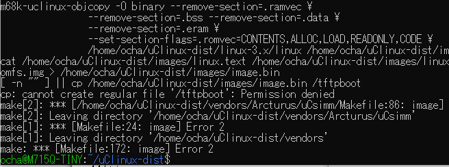

[MC68EZ328 SBCの製作中](https://kanpapa.com/2021/03/mc68ez328-dragonone-sbc-kicad.html " kanpapa  kanpapa 2021年3月15日 08:12 MC68EZ328 DragonOne SBCの基版をKiCadで設計中です。")ですが、ソフトウェアの準備もしておかなければということで、[uClinux](https://ja.wikipedia.org/wiki/%CE%9CClinux "uClinux")をビルドしてみました。ただし、uClinuxの公式サイトはもうなくなっていますので、アーカイブを入手するところから始めます。

ビルドはクロスコンパイル環境で行います。今回は手元のWindows10 WSL（Ubuntu 20.04 LTS 64bit)で行うことにしました。

参考としたサイトは以下のサイトです。

- [Building uClinux for a 68000 Target](https://www.bigmessowires.com/2014/11/06/building-uclinux-for-a-68000-target/)

2014年の記事になりますが、この内容に沿ってArcturus社のuCsimmというMC68EZ328を使用したマイコンボード用のuClinux (3.x kernel)をビルドしてみます。

<!--more-->

### uClinuxの入手

今回使用したアーカイブはこの２つです。uClinuxのソースとToolchainの実行環境（クロスコンパイラ）です。

- [uClinux-dist-20140504.tar.bz2](https://sourceforge.net/projects/uclinux/files/uClinux%20Stable/dist-20140504/uClinux-dist-20140504.tar.bz2 "uClinux-dist-20140504.tar.bz2") (SOURCEFORGE)
- [m68k-uclinux-tools-20121115.tar.bz2](https://code.google.com/archive/p/m68k/downloads "m68k-uclinux-tools-20121115.tar.bz2") (Google Code Archive）

### クロスコンパイル環境の準備

まず、Toolchainを展開します。/usr/local 配下にインストールします。

```
$ cd /
$ sudo tar xf ~/m68k-uclinux-tools-20121115.tar.bz2

```

これで/usr/local配下にm68k-uclinuxというディレクトリができ、/usr/local/binにもm68k-uclinux-\* というバイナリが展開されていることが確認できます。

これでm68kのクロスコンパイル環境ができました。

### uClinuxのビルド

次にuClinuxのソースを作業用ディレクトリに展開します。

```
$ cd
$ tar xf uClinux-dist-20140504.tar.bz2

```

作業用ディレクトリにuClinux-distというディレクトリができます。

make configを行いビルドオプションを選択します。プラットフォームはArcturus社のuCsimmを選びます。これ以外のオプションはひとまずデフォルトのままとしました。

```
$ make config
config/mkconfig > Kconfig
KCONFIG_NOTIMESTAMP=1 /home/ocha/uClinux-dist/config/kconfig/conf Kconfig
*
* uClinux Distribution Configuration
*
*
* Vendor/Product Selection
*
*
* Select the Vendor you wish to target
*
Vendor
1. 3com (DEFAULTS_3COM)
2. ADI (DEFAULTS_ADI)
3. AcceleratedConcepts (DEFAULTS_ACCELERATEDCONCEPTS)
4. Actiontec (DEFAULTS_ACTIONTEC)
5. Akizuki (DEFAULTS_AKIZUKI)・・・・・秋月電子！
6. Alfa (DEFAULTS_ALFA)
7. Altera (DEFAULTS_ALTERA)
8. Amiga (DEFAULTS_AMIGA)
9. Apple (DEFAULTS_APPLE)
> 10. Arcturus (DEFAULTS_ARCTURUS)
11. Arnewsh (DEFAULTS_ARNEWSH)
　:（省略）
66. Xilinx (DEFAULTS_XILINX)
67. senTec (DEFAULTS_SENTEC)
choice[1-67]: 10
*
* Select the Product you wish to target
*
Arcturus Products
1. uC5272 (DEFAULTS_ARCTURUS_UC5272)
  :（省略）
15. uCdimm (DEFAULTS_ARCTURUS_UCDIMM)
16. uCdimm+mtd (DEFAULTS_ARCTURUS_UCDIMM_MTD)
17. uCquicc (DEFAULTS_ARCTURUS_UCQUICC)
> 18. uCsimm (DEFAULTS_ARCTURUS_UCSIMM)
choice[1-18]: 18
```

これでMakefileができましたので、makeをします。

```
$ make
```

残念ながら途中でエラーになりました。

### ビルドエラーの対応

このビルドエラーは参考にしているサイトでも取り上げられています。

まずは、共有ライブラリが見つからないというエラーです。

`/usr/local/libexec/gcc/m68k-uclinux/4.5.1/cc1: error while loading shared libraries: libmpc.so.2:`

これは必要なパッケージをインストール後にシンボリックリンクを張って対応しました。

```
$ sudo apt install libmpc3
$ cd /usr/lib/x86_64-linux-gnu/
$ sudo ln -s libmpc.so.3 libmpc.so.2
```

もう一つ libmpfr.so.4が無いというエラーも同様に対応しました。

```
$ cd /usr/lib/x86_64-linux-gnu/
$ sudo ln -s libmpfr.so.6 libmpfr.so.4
```

次はこのようなエラーがでました。

`/usr/local/m68k-uclinux/bin/ld.real: cannot find -lutil`

こちらはtelnetdのコンパイル時に発生しています。記事と同様にmake configでtelnetdを使わないように設定しました。原因はパラメタがおかしいのではと思われますが、あとで確認することにして、まずはビルドを通します。

``

これで順調にコンパイルが進みました。



最後にimage.binを/tftpbootにコピーできないというエラーがでますが、imagesディレクトリにバイナリ自体はできていますので、特に問題ありません。


### まとめ

2021年のOSでもuClinuxのビルドはできました。今回製作中のMC68EZ328 SBC用にカスタマイズが必要になるでしょうが、ひとまず動かせるものはできそうです。
