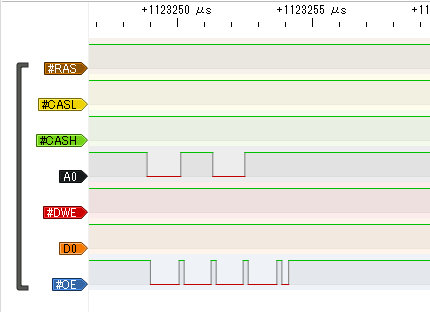
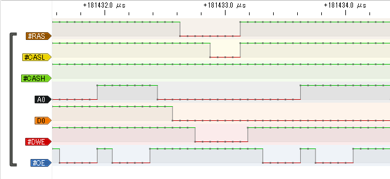

[MC68EZ328 DragonOne SBCでDRAMが認識しない問題](https://kanpapa.com/2021/04/mc68ez328-dragonone-sbc-dram-test.html "MC68EZ328 DragonOne SBCでDRAMが動かなくて悩み中")はまだ解決していません。解決の糸口を見つけるためにロジアナで信号を確認してみます。

### DRAMにロジアナを接続

DRAMにワイヤーをはんだ付けすることで、外部に信号線を引き出します。今回はAWG30のラッピングワイヤーを使用しました。

<!--more-->

ロジアナは格安のもので、ICクリップは付属していないタイプです。そのため、ワイヤーをブレッドボードに接続して、ロジアナに接続しました。

これで信号が見える状態になりました。

### リセットをしてみる

リセット後、本来ならROMにあるSPとPCの初期値を読みに行っているようですが、この基板ではCSA0に何も接続されていないためこれ以上は動かない状態です。

### ブートストラップモードにしてみる

ブートストラップモードにするとブートローダーの動きがアドレスバスとOEに現れます。

### 内部レジスタを初期化してみる

ブートローダーを使用して初期設定を行うとDRAMのRAS/CASに信号が現れました。DRAMコントローラーが動作し、リフレッシュが始まったと思われます。

### DRAMに書き込んでみる

DRAMを配置したアドレスにブートローダーで書き込んでみました。書き込むデータがD0にセットされたあとに、RASで行アドレス、CASで列アドレスが決まり、DWE信号で書き込まれているように見えます。

### DRAMから読み出してみる

DRAMを配置したアドレスをダンプしてみました。RAS/CASで行・列アドレスが決まり、データが出力されているように見えます。OEもLowなのでCPUがこのデータを読み込んでくれるはずなのですが。

残念ながらダンプの結果は$FFがずっと続いている状態です。この時だけでもD0はLowになっているのでどこかは$FF以外になるように思うのですが。

というわけで信号は見えるようになりましたが、DRAMが読めないのは変わりありません。

### 確認できたこと

今回確認できたのは

- CAS/RAS信号は生成されている。
- DRAMは$00000000に配置されている。
- READ/WRITEも信号の流れは合っているように見える。
- ただし、タイミングが合っているかは未確認。（やはりここかな・・）

ハードウェアの接続は問題なさそうなので、あとは初期化パラメタをいろいろいじってみるぐらいしか思いつきませんが、もう少し粘ってみます。
