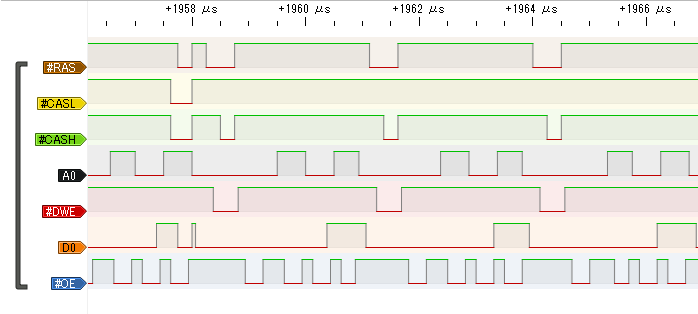
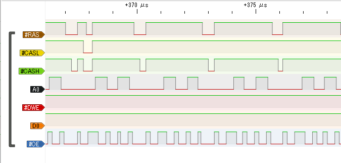

DRAMへのアクセスの様子をロジアナで確認できるように8バイトのIBUFFで動かすことができるプログラムを書きました。bレコードにしてブートローダに読み込ませ実行できます。アセンブラは[EASy68K](http://www.easy68k.com/ "EASy68K")を使用しました。

ここでは$00000000番地にD0レジスタの内容を連続してREAD/WRITEするようにしました。繰り返すことでロジアナでも状態が確認しやすくなります。本来なら固定値を書き込みたいところですが、8バイトに納めるためにこのようにしています。

### WRITEプログラム

```
FFFFFFAA              7          ORG     $FFFFFFAA    ; instruction buffer locationFFFFFFAA              8  START:FFFFFFAA  11C0 0000   9          move.b  d0,$000000FFFFFFAE  60FA       10          bra     STARTFFFFFFB0             11  FFFFFFB0             12          END     START        ; last line of source
```

これをbレコードにすると次のようになります。

```
FFFFFFAA0811C0000060FAFFFFFFAA00
```

bレコードを読み込ませたあとにロジアナで見てみます。DWEがLのところが書き込み動作です。上位バイトのアクセスなので、CASHがLになります。D0はデータバスのbit0ですが、Lが繰り返し書き込まれていることがわかります。



### READプログラム

```
FFFFFFAA              7          ORG     $FFFFFFAA    ; instruction buffer locationFFFFFFAA              8  START:FFFFFFAA  1038 0000   9          move.b  $000000,d0FFFFFFAE  60FA       10          bra     STARTFFFFFFB0             11  FFFFFFB0             12          END     START        ; last line of source
```

これをbレコードにすると次のようになります。

```
FFFFFFAA081038000060FAFFFFFFAA00
```

bレコードを読み込ませたあとにロジアナで見てみます。RASがLになり、CASHがLになっているところがREADです。WRITEと同じように繰り返されています。読み出された(?)データバスのbit0はHになっているようです。



これでタイミングも計りやすくなったので、仕様に沿っているか確認してみます。
