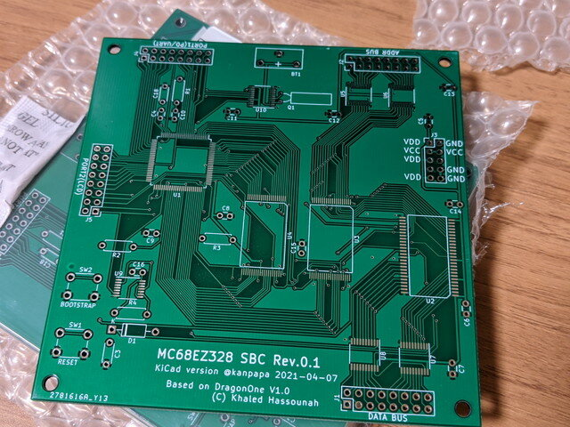

[先日発注したMC68EZ328 DragonOne SBCの基板](https://kanpapa.com/2021/04/mc68ez328-dragonone-sbc-pcb-ordered.html "MC68EZ328 DragonOne SBCの基板を発注しました")が到着しました。

見た目は問題なさそうです。パーツのレイアウトはオリジナルの[DragonOne](http://www.mediumware.net/DragonOne/DragonOne.htm "DragonOne")の基板の写真を参考にしていますが、パターン配線は手作業で一本一本配線しました。プロから見ると甘いところがたくさんあると思いますが、大目にみてください。

表面実装用の[BC型こて先](https://www.hakko.com/japan/tip_selection/type_bc_c.html "BC型こて先")を[おおたFab](https://ot-fb.com/ "おおたFab")さんに置いているので、実装は今週末の予定です。

初めての本格的なSMT基板なので動くかどうかドキドキです。
