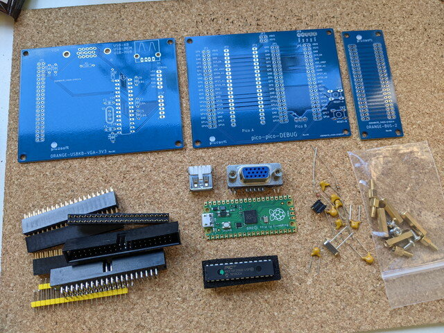
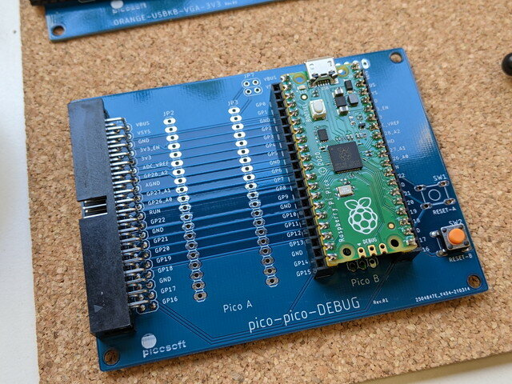
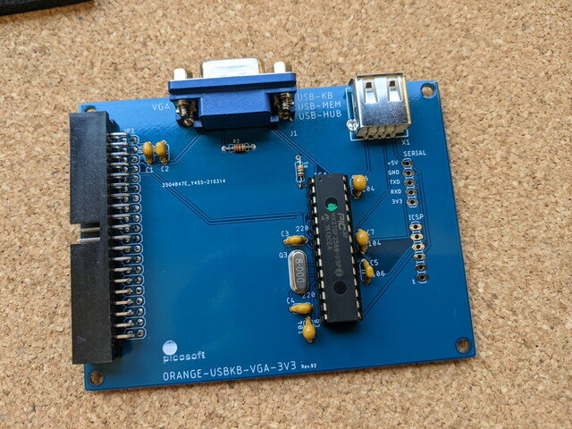
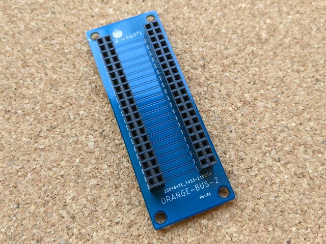
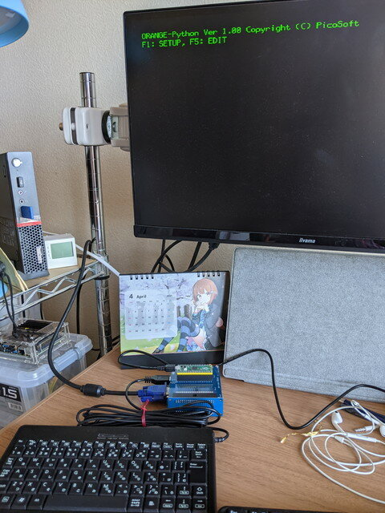

オレンジピコショップさんから[ORANGE-Python（Raspberry Pi Pico版）組立てキット](https://store.shopping.yahoo.co.jp/orangepicoshop/pico-k-038.html)が発売されたので早速購入しました。オレンジピコショップさんは基板の色が選べるのでうれしいのですが、お気に入りの赤基板が売り切れで、今回は青基板にしましたがこの色もなかなか映えます。



これだけのパーツがそろって3,740円というのも信じられませんが、やはりRaspberry Pi Picoの低価格が貢献しているのでしょう。なお、Raspberry Pi PicoとPIC32MXのファームウェアも書き込み済みなので、初心者でも組み立てやすいと思います。

<!--more-->

### ORANGE-Pythonの組み立て

さてさっそく組み立てです。親切な組み立てマニュアルがついているので、慣れている人であれば30分ぐらいで完成するでしょう。

まずはRaspberry Pi Picoにピンヘッダをはんだ付けです。


次にCPU基板をはんだ付けです。シンプルな構造なのであっという間に完成です。CPU基板にはRaspberry Pi Picoも取り付けます。



次はグラフィックボードです。グラフィックボードにはファーム書き込み済のPIC32MX270を取り付けます。CPUボードとはシリアルUARTで接続されていて、PIC32MX270でVGA出力、USBキーボード入力、シリアルUARTを制御するシンプルな構造です。つまりこのグラフィックボードだけでシリアルターミナルの動作をします。詳細は[ORANGE-BUS](http://www.picosoft.co.jp/ORANGE-BUS/index.html "ORANGE-BUS")のページをご覧ください。

製作時の注意としてはコンデンサが似たような形をしているので容量の表示をよく見て間違えないようにはんだ付けします。シリアル、ICSPはコネクタ不要とのことですが、あとで取り付けようと思います。



次はこの２枚の基板を接続するためのバス基板です。私も同じようなバス基板を作ったことがありますが、さすがきれいですね。



最後にこれらの基板を金属スペーサーで固定し、組み合わせると完成です。


### 電源を投入

USBコネクタにキーボードを、VGAコネクタにモニタを接続し、Raspberry Pi PicoにマイクロUSBケーブルを取り付けて、USB電源を供給します。

電源を投入したところ、一発でモニタに文字が表示されました。



簡単なセットアップを行うと、MicroPythonのプロンプトが表示されました。


### Pythonのプログラムを動かしてみる

問題なく動いているようなので、いつものプログラムを動かしてみます。なんとスクリーンエディタも装備しているのでプログラムの入力も容易です。（PC-8001のような画面がまた良い・・）


RUNのファンクションキーを押すと、いつもの画面が表示されました。さすがRaspberry Pi Picoですので、１～２秒であっという間に表示ができました。


今回はベンチマークを動かしましたが、Raspberry Pi PicoのI/Oにいろいろ接続してMicroPythonで制御するのが本来の使い方だと思うので、そちらも試してみたいと思います。

### おまけ

今回使用したPythonのプログラムは以下の通りです。ASCIIART.BASをそのままPythonに移植しています。すでに修正済ですが、最初に掲載したソースに一部バグがありましたので、[Github](https://github.com/kanpapa/benchmark/blob/main/asciiart.py "asciiart.py")にもあげておきました。

```
# asciiart.py

for y in range(-12,13):
    for x in range(-39,40):
        ca=x*0.0458
        cb=y*0.08333
        a=ca
        b=cb
        for i in range(0,16):
            t=a*a-b*b+ca
            b=2*a*b+cb
            a=t
            flag=0
            if (a*a+b*b)>4:
                flag = 1
                break
        if flag == 0:
            print(" ", end="")
        else:
            if i>9:
                i=i+7
            print(chr(48+i), end="")
    print(" ")
```
