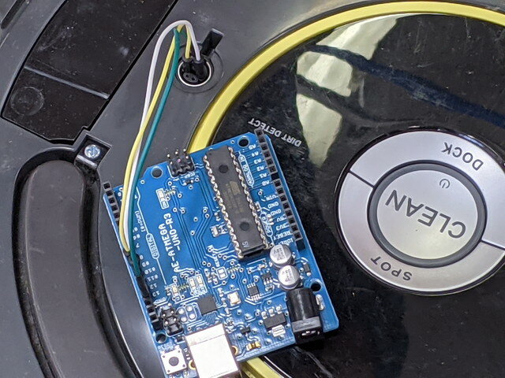

### メカナムホイールの次は？

[おおたfab](https://ot-fb.com/ "おおたfab")さんのセミナー「素人でもロボットをつくりたい」では、[OSOYOOさんのメカナムロボット](https://osoyoo.com/2019/11/08/omni-direction-mecanum-wheel-robotic-kit-v1/ "Metal Chassis Mecanum Wheel Robotic (for Arduino Mega2560) ")のコントロールをArduinoで行ってきましたが、もう少し高度な制御を行うためにプラットフォームを探したところ、ルンバを制御するという記事を見つけました。インターフェースは以下の仕様書で公開されているようです。

- [iRobot Roomba 500 Open Interface (OI) Specification](https://www.irobot.lv/uploaded_files/File/iRobot_Roomba_500_Open_Interface_Spec.pdf "iRobot Roomba 500 Open Interface (OI) Specification")

家庭用の製品ですからハードウェア・ソフトウェアもしっかりしていて、メカナムホイールロボットで行っていたモーター制御より高度で複雑なことができそうに思われます。

### ルンバを入手しよう

中古のルンバであればヤフオクなどでかなり安価に入手することできます。ただし、安いものはバッテリーが劣化していたり、動作不良がある可能性も高いですが、まずは安くて動作確認済のものを探しました。

中古で入手したルンバ620です。お値段は2,400円（充電器付き。送料別）でした。

早速電源をいれてDockボタンをおしたところ、きちんとドックに戻ってくれました。基本的な動作は大丈夫なようです。

### ルンバにArduinoを接続してみる。

ルンバを制御するという記事はインターネットで多数公開されていますが、今回はシンプルな以下の記事を参考にしました。

- [ArduinoからRoombaをSoftware Serialで動かす](https://qiita.com/legokichi/items/36a13e68722c51c72927 "ArduinoからRoombaをSoftware Serialで動かす")

まずは記事に従って上側のカバーをはずし、Arduinoをジャンパー線でルンバに接続します。

接続が完了しました。

### サンプルプログラムを動かしてみる。

次に記事中のRoombaが左右に身を振り「イヤイヤ」をするプログラムを動かしてみます。いつも通りコンパイルしてArduinoに書き込みましたが、何も反応がありません。

リセットをしても、ルンバの電源を再投入しても同じです。Arduinoのプログラムもシンプルですし、偶然にも記事で使っているルンバの型番も同じです。動かない原因を探っていきます。

### トラブルシューティング

このようなシリアル通信のトラブルでよくあるのはRX/TXを逆に接続している場合です。今回も原因はこれでした。RX/TXを正しく接続しなおしました。

これでもう一度動かしてみると、見事に「イヤイヤ」を始めました。

プログラムを見るとわかりますが、この「フリフリ」は左回転、右回転のコマンドを繰り返すことで行っています。普通にArduinoの電源を切ると最後に受信したコマンドのままになってしまいました。

このあと、止める方法がわかりません。このインターフェースを使っているときは電源スイッチの制御もできなくなってしまいました。

結局、Arduinoのプログラムで適当なコマンドを送ったところ停止することができました。緊急停止ができるような仕掛けを準備しておくのがよさそうです。

### 次回

今回はArduinoをつかってルンバを動かしましたが、ROIに記載されているコマンドはまだまだたくさんあります。これらのコマンドを試して様々な動作をさせてみるのと、センサーやスイッチの入力もできるはずですので、そのあたりも試す予定です。
