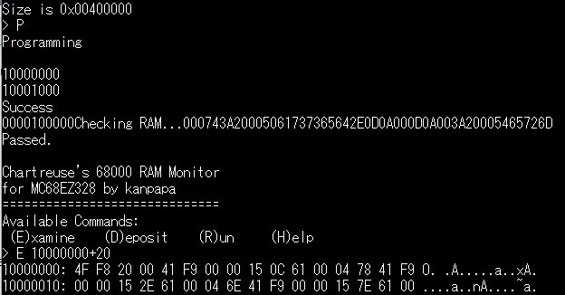
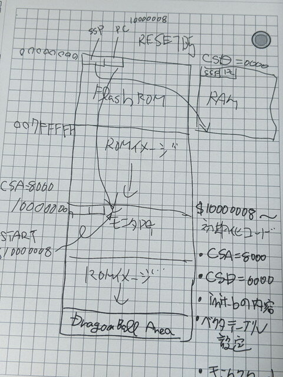

フラッシュツールの開発が完了し、フラッシュメモリの情報の表示だけでなく、消去や書き込みも行えるようになりました。68k-Monitorをベースとしたので比較的短時間にできました。


<!--more-->

### フラッシュメモリの書き込みテスト

フラッシュメモリに$1000からのメモリの内容を書き込んでみます。書き込みが終わったあとにブートローダーからモニタプログラムをロードして起動し、Flashメモリのアドレスである$10000000をダンプしてみます。



無事、$10000000からにデータが書き込まれていることが確認できました。書きこんだデータを消去できることも確認しました。

### フラッシュメモリからモニタを直接起動してみる

これまではCPUに搭載されているブートローダの助けを借りてメモリへの書き込みやプログラムの実行を行ってきました。ブートローダを使わないで直接フラッシュメモリに書き込まれたモニタを起動することを考えます。

68000にはベクタテーブルがメモリの先頭に配置されているので、ここはRAMにしておかないとベクタテーブルの設定や変更ができません。このため最終的には以下のメモリマップになります。

```
00000000 +----------+         |  DRAM    |007FFFFF +----------+         |    :     |10000000 +----------+         | FlashMem |107FFFFF +----------+         |          |
```

このメモリ配置にするにはCSA、CSDレジスタに適当な値を設定すればできますが、レジスタの設定は起動したプログラム中で行う必要があります。

まず、リセット時にはCSA0がアクティブとなり、CSA0に接続しているフラッシュメモリがすべてのメモリ空間に割りつけられます。このため$00000000がフラッシュメモリの先頭となります。

68000がリセットされたときには、メモリの00000000から4バイトがスタックポインタの初期値、00000004から4バイトが実行開始アドレスと決まっています。

このため、以下の手順でフラッシュメモリにあるプログラムを動かせるはずです。

1. フラッシュメモリの先頭にスタックポインタのアドレスと実行開始アドレスを書き込む。実行開始アドレスはフラッシュメモリが配置されるアドレス（$10000008）にし、そこにモニタプログラムを書き込んでおく。
2. リセットするとフラッシュメモリは$00000000に割り当てられるので、フラッシュメモリの先頭に書かれているスタックポインタのアドレスと実行開始アドレスをCPUが読みこんで処理を開始する。
3. 実行開始アドレスは$10000008となっているが、フラッシュメモリはすべてのメモリ空間に割り付けられているため、$10000000からもフラッシュメモリにアクセスでき、そこに書き込まれているコードが実行される。
4. コード中でinit.bと同様なCPUのレジスタ設定を行う。CSA, CSDのレジスタが設定された時点でフラッシュメモリが$10000000～、DRAMが$00000000～となる。実行しているコードの内容は変わらないのでこのまま処理が実行できる。
5. スタックポインタをDRAM上のアドレスに設定する。これでスタックが使えるようになる。
6. UARTの初期設定を行う。
7. モニタプログラムを実行する。

図にするとこんな感じです。（手書きですみません）



これが実現するようにMonitor.bを作成し、ブートローダーで起動したフラッシュツールでメモリ上に配置した書き込み用データをフラッシュメモリに書き込み、リセットを行ったところ、見事にフラッシュメモリ上のモニタが起動できました。


これでブートローダーを使わずに、リセットスイッチを押すだけでいつでもモニタが起動できるようになりました。

次はこのモニタで[アプリケーションを動かしてみます](https://kanpapa.com/2021/05/mc68ez328-dragonone-sbc-ehbasic.html "MC68EZ328 DragonOne SBCでEnhanced 68k BASICを動かしました")。
