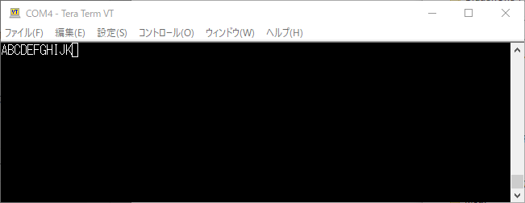
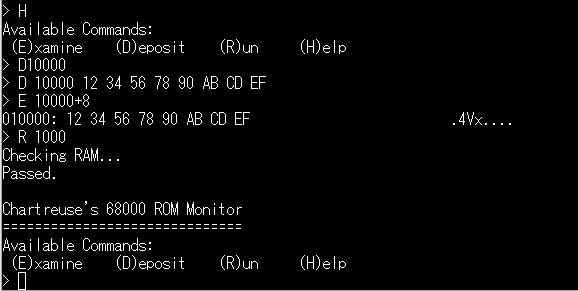

[DRAMのおかげで8MByteという広いメモリ空間](https://kanpapa.com/2021/05/mc68ez328-dragonone-sbc-dram-worked.html "MC68EZ328 DragonOne SBCでDRAMが動きました")ができました。まずはモニタプログラムを載せて自由自在にコントロールできるようにしてみますが、その前にシリアル入出力の確認を進めます。

### Hello Worldを表示してみる

MC68EZ328のUART送信レジスタに文字コードを書き込むことで、シリアルターミナルに文字を表示することができます。テストプログラムをアセンブルし生成されたSレコードからBレコードに変換したあとに、ブートローダーで読み込ませて実行します。ソースは[GitHub](https://github.com/kanpapa/MC68EZ328 "kanpapa / MC68EZ328")にコミットしておきました。

実行結果は以下のようになりました。

### エコーバックをしてみる

次は入力の確認です。UART受信レジスタに読み込んだ文字をそのままUART送信レジスタに出力します。キーボードから入力した文字がそのままターミナルに表示されるはずです。

実行結果は以下のようになりました。

### モニタプログラムを移植してみる

シンプルで移植が容易な68000用のモニタプログラムをGitHubで探したところ手頃なものが見つかりました。2015年にHayden Kroepfl (ChartreuseK)さんが自作の68Kブレッドボードコンピュータ用に作成したもののようです。

- [ChartreuseK / 68k-Monitor](https://github.com/ChartreuseK/68k-Monitor " ChartreuseK / 68k-Monitor")

ROM用のモニタですが、アドレスを変更すれば、RAMでも動かせるはずです。入出力も１文字出力と１文字入力だけなので、先ほどテストしたルーチンをそのまま組み込めば良さそうです。このソースは[EASy68K](http://www.easy68k.com/ "EASy68K")用なので簡単にアセンブルもできました。

移植したモニタをSレコードからBレコードに変換したあとに、ブートローダーで読み込ませたところ無事モニタが起動しました。メモリチェック機能もあるようです。

メモリダンプ、メモリ書き換え、プログラム実行という機能しかありませんが、まずは十分な内容です。

BBUGの方式に比較して表示速度も速くストレスがなくなりました。今回は最低限の修正しか行っていないので、メモリチェックの範囲の変更や、Sレコードの読み書き機能など拡張の余地はあるので、余力があればチャレンジしてみようと思います。

テストプログラムのソースや実際に動くBレコードは[GitHub](https://github.com/kanpapa/MC68EZ328 "MC68EZ328")にあげておきました。

次はいよいよフラッシュメモリへの書き込みテストです。
