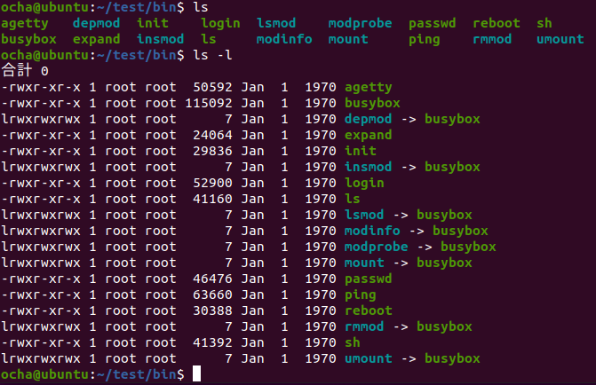

### initがみつからない？

[起動中のメッセージが表示されるようになったDragonOneのuClinux](https://kanpapa.com/2021/05/mc68ez328-dragonone-sbc-uclinux-part1.html "MC68EZ328 DragonOne SBCでuClinuxが起動しました（その１）")ですが、次のような画面で止まってしまいました。


最初に起動されるプロセスであるinitが見つからないとのこと。ビルドの結果をみるかぎり、initはromfsに含まれているはずなのですが。おまけにconsoleも見つからないという警告も表示されています。この原因を探ってみます。

<!--more-->

### エラーが出ている箇所のソースを探す

カーネルの起動時に表示されているメッセージですから、linux-2.4.xのディレクトリ配下のソースを検索してみました。該当の箇所は以下の部分でした。

uClinux-dist/linux-2.4.x/init/main.c の static int init(void \* unused)

```
        /*         * We try each of these until one succeeds.         *         * The Bourne shell can be used instead of init if we are         * trying to recover a really broken machine.         */        if (execute_command)                run_init_process(execute_command);        run_init_process("/sbin/init");        run_init_process("/etc/init");        run_init_process("/bin/init");        run_init_process("/bin/sh");        panic("No init found.  Try passing init= option to kernel.");}
```

initプロセスを立ち上げる部分です。romfsには/bin/initと/bin/shは存在するはずなので、起動されても良さそうなものなのですが。

少し上のソースにconsoleのエラーメッセージもありました。

```
        if (open("/dev/console", O_RDWR, 0) < 0)                printk("Warning: unable to open an initial console.\n");
```

これを見る限り、/dev/consoleや/bin/initが見えていないように思えます。しかし、起動時のメッセージでは、romfsはmountされているように見えます。

```
Blkmem copyright 1998,1999 D. Jeff DionneBlkmem copyright 1998 Kenneth AlbanowskiBlkmem 1 disk images:0: 1006BEE0-100F02DF [VIRTUAL 1006BEE0-100F02DF] (RO) RAMDISK driver initialized: 16 RAM disks of 4096K size 1024 blocksizeVFS: Mounted root (romfs filesystem) readonly.
```

### romfsをmountしてみる

何らかの原因でromfsが正常に読めないのではと、実際のromfs.imgの中身をのぞいてみることにしました。romfsをmountするには以下のようにループバックを指定します。

```
$ mkdir ~/test$ sudo mount -o loop romfs.img ~/test
```

ビルドで生成されたromfs.imgをWSL2でmountしようとしましたが、うまく動かなかったのでVMware上のubuntuにコピーして確認しました。


mountできました。lsで/binを見てみます。



initもありますし、shもあります。/devもみてみます。


/dev/consoleも存在します。次は/etcです。


initが参照する/etc/inittabも存在します。ramfs.imgがありますが、これは/varにマウントされるもののようです。


このような状態で環境としては問題無いようにみえます。

### カーネルからデバック情報を出力してみる

試しにkernelから情報を表示してみました。uClinux-dist/linux-2.4.x/init/main.cに以下の修正を加えてビルドします。

```
static void run_init_process(char *init_filename){        argv_init[0] = init_filename;                printk("run_init_process: init_filename=%s\n",init_filename);        execve(init_filename, argv_init, envp_init);}
```

この修正により、execve()にプログラムのファイル名が渡されているか確認できるはずです。フラッシュメモリに書き込んでリセットしたところ、渡されているパスが確認できました。


### 動かない原因は何？

以上の結果から、romfsの内容は正しいのですが、正常にmountできておらずkernelからromfsのファイルが読めていない可能性が高そうです。romfsをmountしている箇所を確認してみます。（続く）
