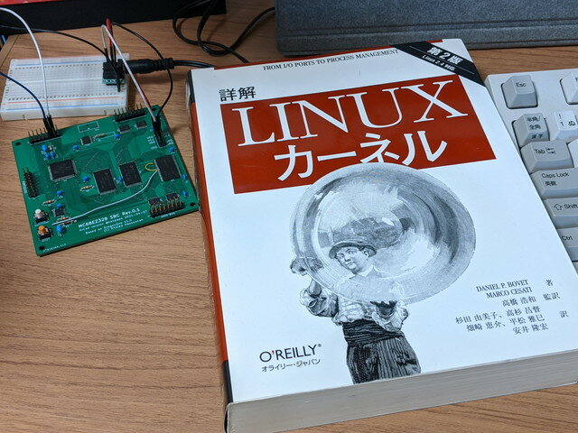

start\_kernelの続きです。ちょうどフリマで購入した参考書が届きました。kernel 2.4対応の詳解LINUXカーネル 第2版です。旧版なので格安というメリットはあります。ただシステムの起動の部分は付録の章となっていてあまり詳しく書かれていませんでした。コードを追うしかなさそうです。

 <!--more-->

### 再びstart\_kernelの続きから

前回追ったsetup\_arch()から戻ってくると、次はコマンドラインを表示します。今回は0を入れたのでコマンドラインには何も表示されません。parse\_options()もコマンドラインに何もないので飛ばします。

```
	setup_arch(&command_line);
printk("Kernel command line: %s\n", saved_command_line);
parse_options(command_line);

```

その後、初期化プロセスがつづきます。console\_init()は関連ありそうなので見てみましょう。

```
    trap_init();
init_IRQ();
sched_init();
softirq_init();
time_init();
console_init();

```

### コンソールの初期化

console\_init()は、drivers/char/tty\_io.cにありました。ttyのでディスクリプタを登録したあとに、termioを設定しています。その後にm68328\_console\_init()を呼びます。

```
void __init console_init(void)
{
/* Setup the default TTY line discipline. */
memset(tty_ldiscs, 0, NR_LDISCS*sizeof(struct tty_ldisc));
(void) tty_register_ldisc(N_TTY, &tty_ldisc_N_TTY);
/*
* Set up the standard termios.  Individual tty drivers may
* deviate from this; this is used as a template.
*/
memset(&tty_std_termios, 0, sizeof(struct termios));
memcpy(tty_std_termios.c_cc, INIT_C_CC, NCCS);
tty_std_termios.c_iflag = ICRNL | IXON;
tty_std_termios.c_oflag = OPOST | ONLCR;
tty_std_termios.c_cflag = B38400 | CS8 | CREAD | HUPCL;
tty_std_termios.c_lflag = ISIG | ICANON | ECHO | ECHOE | ECHOK |
ECHOCTL | ECHOKE | IEXTEN;
/*
* set up the console device so that later boot sequences can
* inform about problems etc..
*/
m68328_console_init();
}

```

m68328\_console\_init()はコンソールにドライバを登録しているようです。コンソールを追うのはこのあたりまでとしておきます。

```
static struct console m68328_driver = {
name:		"ttyS",
write:		m68328_console_write,
read:		NULL,
device:		m68328_console_device,
unblank:	NULL,
setup:		m68328_console_setup,
flags:		CON_PRINTBUFFER,
index:		-1,
cflag:		0,
next:		NULL
};
void m68328_console_init(void)
{
register_console(&m68328_driver);
}

```

### カーネルの初期化

start\_kernelに戻ります。以降も初期化が続きますが、mountとは直接関係ないので飛ばします。

```
	if (prof_shift) {
unsigned int size;
/* only text is profiled */
prof_len = (unsigned long) &_etext - (unsigned long) &_stext;
prof_len >>= prof_shift;
size = prof_len * sizeof(unsigned int) + PAGE_SIZE-1;
prof_buffer = (unsigned int *) alloc_bootmem(size);
}
kmem_cache_init();
sti();
calibrate_delay();
mem_init();
kmem_cache_sizes_init();
pgtable_cache_init();
if (num_mappedpages == 0)
num_mappedpages = num_physpages;
fork_init(num_mappedpages);
proc_caches_init();
vfs_caches_init(num_physpages);
buffer_init(num_physpages);
page_cache_init(num_physpages);
signals_init();
proc_root_init();
check_bugs();
acpi_early_init(); /* before LAPIC and SMP init */
printk("POSIX conformance testing by UNIFIX\n");
smp_init();

```

最後に実行されるrest\_init()は重要な部分なので見てみます。

```
	rest_init();
}

```

### initスレッドの生成

rest\_init()はinit/main.cにあります。ここでinitスレッドを起動し、cpu\_idle()に入ります。

```
static void rest_init(void)
{
kernel_thread(init, NULL, CLONE_FS | CLONE_FILES | CLONE_SIGNAL);
unlock_kernel();
current->need_resched = 1;
cpu_idle();
}

```

ここまででinitスレッドの起動までたどり着き、rootファイルシステムのmountに近づいてきました。（続く）
