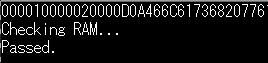
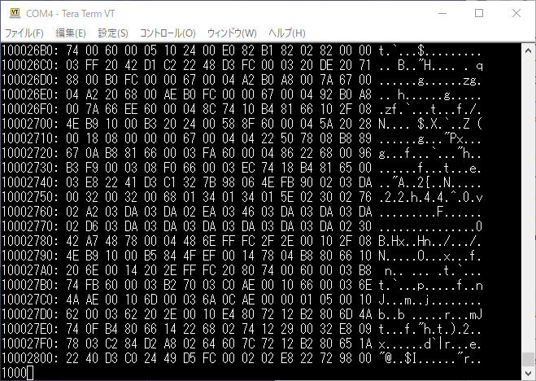

[uClinuxのブートプロセスを確認](https://kanpapa.com/2021/05/mc68ez328-dragonone-sbc-uclinux-part7.html "MC68EZ328 DragonOne SBCでuClinuxを動かす(7) ～rootにmountする～")して問題がみつかりませんでした。やはりLinux 2.4.xですのでカーネルは枯れているとおもわれます。そう考えるとファイルシステムがmountできない原因はハードウェア起因か何らかの誤設定である可能性が残ります。

まずはハードウェアに問題がないか再確認します。これまでモニタプログラムを何度も動かしていますが、これは8MBメモリのほんの一部分を使用しているにすぎません。メモリの後半の部分に問題があるとか、フラッシュメモリにうまく書き込まれていないなども考えられます。

### DRAMのメモリチェック

メインメモリであるDRAMのチェックを行います。このSBCには8MBのDRAMが実装されています。現在使用しているモニタには起動時にメモリチェック機能が実装されていますが、時間がかかるのでチェックする範囲を狭くしていました。これをモニタの動作の支障のないアドレス$00002000～$007FFFFFをチェックするように設定してみました。



Passedと表示されるまで、3分01秒かかりました。これは$AAと$55と$00をそれぞれ書き込み一致しなければメモリ不良と判断してFailedと表示されるものです。簡易的なチェックではありますが、問題なさそうです。

<!--more-->

### フラッシュメモリのデータチェック

フラッシュメモリにはuClinuxのカーネルやromfsのイメージを書き込んでいます。このイメージデータが正常に書き込まれているか確認します。どこかが違う値になっていたり、途中で書き込みが止まっていて、後半書き込めていないといった可能性もあります。おまけにフラッシュメモリの書き込みプログラムはスクラッチで作りましたので、そもそも書き込みプログラムが間違っている可能性もあります。

次の流れで進めてみます。

1. モニタプログラムのダンプ機能でフラッシュメモリの領域をダンプし、それをターミナルログに出力します。
2. 出力したメモリダンプのログをPythonのスクリプトでバイナリデータに変換します。
3. 2.で作成したバイナリデータと書き込んだイメージデータ（image.bin）を比較します。

まずはメモリダンプです。フラッシュメモリの範囲である$10000000～$100FFFFFをTeratermのログに出力します。（フラッシュメモリは8MBなので実際は$107FFFFFまでですが、image.binは$100000以内に収まっているので。）



ログ出力をPythonスクリプトに読み込んで、バイナリファイルを作成します。スクリプトは[dtobin.py](https://github.com/kanpapa/MC68EZ328/blob/main/bbug/dtobin.py "dtobin.py")を書きました。

```
C:\DragonOne>python dtobin.py dumpdata_flash_#62.log
C:\DragonOne>dir dumpdata_flash_#62.*
C:\DragonOne のディレクトリ
2021/05/27  08:23         4,980,736 dumpdata_flash_#62.log
2021/05/28  07:49         1,048,576 dumpdata_flash_#62.log.bin
2 個のファイル           6,029,312 バイト
0 個のディレクトリ  270,952,865,792 バイトの空き領域
C:\DragonOne>

```

生成したフラッシュメモリのイメージデータをuClinuxのビルド環境にコピーし、比較してみます。

```
ocha@M715Q-TINY:~$ hexdump -C dumpdata_flash_#62.log.bin > p1
ocha@M715Q-TINY:~$ hexdump -C image.bin > p2
ocha@M715Q-TINY:~$ diff -rc p1 p2 > p3
ocha@M715Q-TINY:~$ head -10 p3
*** p1  2021-05-28 07:53:22.874350300 +0900
--- p2  2021-05-28 07:53:47.364350300 +0900
***************
*** 57739,63394 ****
000e9ba0  2e 00 00 00 00 00 00 00  00 00 00 00 00 00 00 00  |................|
000e9bb0  00 00 00 00 00 00 00 00  00 00 00 00 00 00 00 00  |................|
*
! 000e9dd0  ff 3c 00 10 b2 e8 60 18  65 25 23 c1 71 00 50 11  |.<....`.e%#.q.P.|
! 000e9de0  52 81 31 41 00 10 f2 0a  b2 80 67 00 fe 9e 20 d4  |R.1A......g... .|
! 000e9df0  22 68 10 70 b2 a8 00 18  65 e0 2f 08 4e 96 58 8f  |"h.p....e./.N.X.|
ocha@M715Q-TINY:~$ hexdump -C image.bin | tail -10
000e9b40  2f 76 61 72 2f 74 6d 70  00 00 00 00 00 00 00 00  |/var/tmp........|
000e9b50  00 00 00 09 00 08 41 a0  00 00 00 00 89 96 4c 57  |......A.......LW|
000e9b60  76 61 72 00 00 00 00 00  00 00 00 00 00 00 00 00  |var.............|
000e9b70  00 08 41 c0 00 00 00 20  00 00 00 00 d1 c9 be 20  |..A.... ....... |
000e9b80  2e 2e 00 00 00 00 00 00  00 00 00 00 00 00 00 00  |................|
000e9b90  00 00 00 00 00 08 41 80  00 00 00 00 d1 f7 be 80  |......A.........|
000e9ba0  2e 00 00 00 00 00 00 00  00 00 00 00 00 00 00 00  |................|
000e9bb0  00 00 00 00 00 00 00 00  00 00 00 00 00 00 00 00  |................|
*
000e9dd0
ocha@M715Q-TINY:~$

```

$00000000～$000e9dcfまでは一致していることが確認できます。image.binは$000e9dcfまでなので以降は不一致で問題ありません。

これでimage.binがフラッシュメモリに正しく書き込めていることが確認できました。

### どこかの設定ミスなのか？

基本ハードウェアの動作も問題ないことが確認できてしまいました。

残るはビルド時の設定、CPUの設定レジスタの設定あたりが残りますが、何度も見直した部分なので新たな発見があるかどうか。でも、ここまで動いているのであと一歩だと信じて調べてみます。
