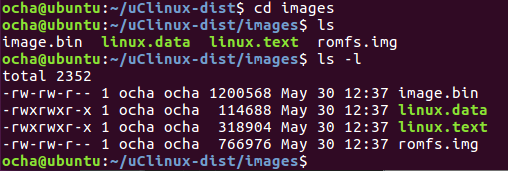

[ハードウェアも問題がなく](https://kanpapa.com/2021/05/mc68ez328-dragonone-sbc-uclinux-part8.html "MC68EZ328 DragonOne SBCでuClinuxを動かす(8) ～ハードウェアを再確認する～")、カーネルも見た目は問題が無さそうに見えます。残る手としてお手本としているuCsimmが販売されていた2002年当時のuClinuxソースがビルドできる環境を再現してみます。

### ビルド環境の構築

ツールチェインが32bitバイナリであることもあり、ホストOSも当時に近くなるように少し古いものを使います。今回はVMware Player上にUbuntu 16.04 LTS 32bitをインストールしたものをビルド環境としました。

当時のソースとツールチェインはInternet Archiveから探して、以下のものをダウンロードしました。

- [uClinux-dist-20020220.tar.gz](https://web.archive.org/web/20181014184953/http://www.uclinux.org/pub/uClinux/dist/uClinux-dist-20020220.tar.gz "uClinux-dist-20020220.tar.gz")
- [m68k-elf-tools-20030314.sh](https://web.archive.org/web/20170722083915/http://www.uclinux.org/pub/uClinux/m68k-elf-tools/m68k-elf-tools-20030314.sh "m68k-elf-tools-20030314.sh")

ツールチェインはshで実行するとバイナリが/usr/local配下に展開されるのですが、現在のtailコマンドの仕様が若干変わっていて、そのままでは展開できなかったので39行目のオプションを修正し展開できました。

（修正前）　tail +${SKIP} ${SCRIPT} .....

（修正後）　tail -n +${SKIP} ${SCRIPT} .....

これで当時のビルド環境が構築できました。

<!--more-->

### ソースコードの修正

今回kernel-2.4.xを使います。これまでuClinux-dist-20140504で修正した内容を参考にしてDragonOne SBCに合わせてソースを修正しました。

修正したソースはGitHubの[kanpapa/uClinux-dist-20020220](https://github.com/kanpapa/uClinux-dist-20020220 "GitHub kanpapa/uClinux-dist-20020220")にコミットしておきました。

ビルドが終わり、無事image.binができました。



バイナリエディタで内容を確認し問題無さそうでしたので、フラッシュメモリに書き込みました。

uClinuxのバージョンは以下のようになりました。

```
Linux version 2.4.17-uc0 (ocha@ubuntu) (gcc version 2.95.3 20010315 (release)
(ColdFire patches - 20010318 from http://fiddes.net/coldfire/)
(uClinux XIP and shared lib patches from http://www.snapgear.com/)) #11 Sun May 30 12:36:59 JST 2021
```

### uClinuxにログインできない

最初に起動したときはカーネルの設定をデフォルトで行ったため、LANコントローラの応答を待ってしまいハングアップしてしまいました。


このため、ネットワーク機能を外してビルドを行ったところ、uClinuxは無事起動してくれました。motdも表示されているのでファイルシステムも読めているようです。ただしログインプロンプトが表示されません。


キーボードで入力すると入力した文字のエコーバックが返ってきます。完全に暴走しているわけではなく、何等かの原因でloginが動いていないようです。

### ログインプロンプトが表示されない原因は？

原因を追ってみます。motdが表示されているのでファイルシステムは読めているでしょう。最終的にinitプロセスが起動し、/etc/inittabにはagettyとloginが書かれているので本来であればここでログインプロンプトが表示されるはずです。


initプロセスの状態を確認するために、simpleinit.cでコメントとなっていた #define DEBUGGING を有効にしたところ、inittabを読み込んでいることが確認できました。


なぜ、ログインプロンプトが表示されないのか。同様な問題が報告されていないか、過去のuClinux-devアーカイブをみたところ以下の記事が見つかりました。

- [\[uClinux-dev\] No Shell or Login Prompt on uCdimm Running 2.4 Kernel](http://mailman.uclinux.org/pipermail/uclinux-dev/2002-June/009168.html "[uClinux-dev] No Shell or Login Prompt on uCdimm Running 2.4 Kernel")

どうもinitに問題があるようで、simpleinit.cを完全に書き換えたようです。こちらのソースを反映して再びビルドです。

### 無事uClinuxが起動しました

image.binをフラッシュメモリに書き込んでリセットしました。


やっとログインプロンプトが表示されました。

なぜ、uClinux-dist-20140504とgcc4では動かなかったのか。uClinux-distのバージョンとツールチェインの組み合わせが関係していそうです。たぶん新しいバージョンではディスコンになったMC68EZ328 CPUの動作確認をしていないのではないかと思われます。その代わり新しいCPUのサポートが増えているわけですが。

### m68k uClinuxを探検してみる

ユーザ名とパスワードを入力してログインできました。続けてlsコマンドをたたいてみます。


romfsのファイルがみえました。

psコマンドでは複数のプロセスが確認できました。ここで試しにinetdをkillしてみました。


再びinetdが起動していることがわかります。プロセス番号が新しいものになっています。

### 今後の予定

次のようなことを考えています。

- uClinux上でのユーザアプリケーションの動かしかたをまとめる。
- シリアルコンソールからユーザアプリケーションがアップロードできるようなローダーを作る。（毎回imageを焼くのは大変）
- uCsimmに実装されているCS8900A LANコントローラを入手してネットワークに接続する。
- MC68EZ328 CPUに標準で実装されているLCDのインターフェースで何かできないか（実はカーネルにはLCDのフレームバッファなども実装されています）

まだまだできることはありそうです。可能な範囲で試してみます。

### 謝辞

これまでMC68EZ328の基板作成からuClinuxを動かすまでをTweetしてきましたが、いろんなかたに助言をいただき大変助かりました。

また、過去のuClinux-devアーカイブが大変参考になりました。先人のかたも同じ問題に遭遇し解決にむけて協力していたんだということがよくわかりました。

なかなかこのようなレトロCPUを動かそうという人はいないと思いますが、そういうかたのためにも、作業手順や修正済のソースはGitHubにコミットしておこうと思います。
