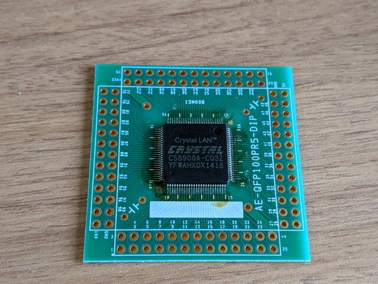

[MC68EZ328 SBCでuClinux](https://kanpapa.com/2021/05/mc68ez328-dragonone-sbc-uclinux-part9.html "MC68EZ328 DragonOne SBCでuClinuxを動かす(9) ～2002年のビルド環境を再現～")が動くようになりましたがネットワークはまだ使えません。先日動作確認をした[uCsimm](https://kanpapa.com/2021/06/mc68ez328-ucsimm-1.html "uCsimm")ではLANコントローラーとして[Cirrus Logic社のCS8900A](https://www.jp.cirrus.com/products/cs8900a/)が搭載されています。uCsimmやデータシートを参考にしてMC68EZ328 SBCにLANコントローラを接続してみます。

### まずは回路図作成とパーツ集めから

CS8900AはISAバス用に設計されたLANコントローラです。データシートも容易に入手できましたので、uCsimmの基板を参考にしながら回路図を起こしました。ほとんどのパーツは手に入りますが、CS8900AはAliexpressでの注文です。

<!--more-->

またパルストランスが特殊なもの（TTR 1:2.5）でしたが、マルツパーツで取り寄せて購入できました。

### ブレッドボードに実装

LANコントローラの回路はブレッドボードに実装し、MC68EZ328 SBCに接続しますが、その前にMC68EZ328 SBC単体で、CS8900Aを接続するためのChip Selectが正常に動作しているかを確認しました。CS8900Aが接続されるI/Oアドレスを連続してアクセスするプログラムを書き、CS信号がLになることを確認しました。

いよいよ試作したCS8900A LANコントローラとMC68EZ328 SBCを接続します。16本のデータバスと4本のアドレスバス、何本かの制御信号をブレッドボード用のワイヤーで接続します。ワイヤーがやや短かったのでMC68EZ328 SBCの基板が立ってしまいました。

配線は完了しましたが、MC68EZ328 SBCとuCsimmとはハードウェアが異なりますので、動作させるためにはuClinuxのカーネルを修正してビルドする必要があります。

### uClinuxビルド環境の再構築

この機会にuClinuxのビルド環境を整理することにしました。これまでは32bit環境が必要なため、古いUbuntuを使ってきましたが、現在でも32bit環境をサポートしているdebianにビルド環境を移行することにしました。

また必要なソースやスクリプトをGitHubに登録することで、再現性も改善しました。ビルド環境の構築手順はGitHub.comに登録しておきました。

- [uClinuxのビルドからフラッシュへの書き込みまで](https://github.com/kanpapa/MC68EZ328/blob/main/uClinux-build2flash.md "uClinuxのビルドからフラッシュへの書き込みまで") (GitHub.com)

### uClinuxでCS8900Aが認識されない

最初から一度で動作するとは思っていませんでしたが、やはりuClinuxでCS8900Aが認識できていないようで、ブート中に止まってしまいます。ただし変更したI/Oアドレスは正しく表示されています。

ダメ元でLANにも接続してみましたが、LINKとActiveのLEDは点滅することを確認できました。LANコネクタまでの回路はうまく動いているようです。

### アセンブラで書いたテストプログラムで確認

いきなりuClinuxでの確認ではなく、モニタでCS8900Aと接続ができているかを確認することにします。

CS8900AとはI/Oモードを使っていて、そのI/O空間はメモリにマッピングされます。モニタでI/O空間の読み書きはできているようですが、正しい動きなのかは確認できません。そこで動作確認用にI/Oモードを使ってCS8900Aの内部レジスタを見るプログラムをアセンブラで作りました。

作成したバイナリをモニタで入力して実行しました。

CS8900AのProduct Identification Code = 0E63000A が読めました。プロダクトコードからCS8900A Rev.Fのようです。これでハードウェア的には接続できていることが確認できました。

### 今後の進め方

ハードウェアのめどが立ったので、次はuClinuxのカーネルを修正しながら確認を進めるしかなさそうです。じっくり取り組んでみます。
