### 突然の0x80070035エラーが発生

久しぶりにThinkPad X1をQNAP NASにつなげようとしたところ、つながりませんでした。こんな画面が表示されてしまいます。エラーコードは 0x80070035 です。

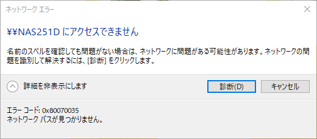

いろいろ試しても接続できません。デスクトップPCでは問題なく接続できています。やむなくThinkPad X1のWindows 10を再インストールしてみました。

しかし、状況はかわらず。試しにQNAPのIPアドレスを変更してみましたが、つながりません。おまけにデスクトップPCからも接続できなくなってしまいました。

ちなみにQNAPのファームウェアは現在最新の[QTS 4.5.4.1723 build 20210708](https://www.qnap.com/ja-jp/release-notes/qts/4.5.4.1723/20210708 "QTS 4.5.4.1723 build 20210708")を使用しています。

<!--more-->

### SMBプロトコルを見てみよう

NASが利用できないのはまずいので、[Wireshark](https://www.wireshark.org/ "WireShark")でSMBプロトコルをみてみることにしました。

smb or smb2 でフィルタします。

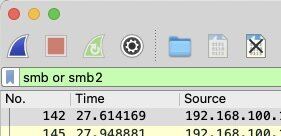

NASに接続しようとすると、一番最初におこなわれるSMBプロトコルのネゴシエーションでエラーになっていることがわかりました。

もう少しプロトコルの詳細をみてみます。

最初にSMB 2はつかえますか？　という問いに

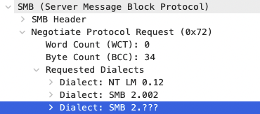

SMB 2以上は使えますと返しています。

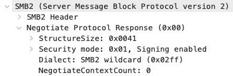

次にSMB 2以上のこれらのプロトコルは使えますかという問いに、

使えませんと返しているようです。

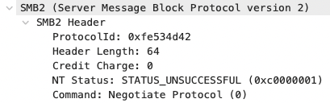

いやいやここはSMB 3が使えるよと返して欲しいところなのですが。

念のためsmb2statusで見てみると、SMB3は有効と表示されます。

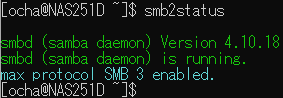

### 正常なSMBプロトコルを確認する

ここで正しいSMBプロトコルを確認したいので、昔使っていた[NanoPi NAS](https://kanpapa.com/2017/11/nano-pi-nas-case-kit.html "Nano Pi NEO用NASケースキットを組み立ててみた")をセットアップして、SMBプロトコルを確認してみます。

先程と同じように、最初にSMB 2は使えますか？　という問いに

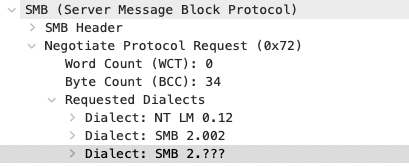

SMB 2以上は使えますと返しています。

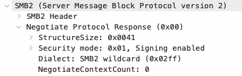

次にSMB 2以上のこれらのプロトコルは使えますかという問いで、

SMB 3.0が使えますと返し、

その後セッションの初期化が始まっています。

### 異なるOSのクライアントでも試してみる。

macOSでも同様に試してみましたが、状況は同じで、このようなエラー画面となりNASに接続できません。

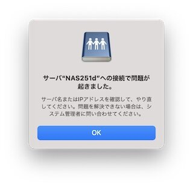

Wiresharkで確認したところ、同じようなエラーが確認できました。これはSMBサーバー(QNAP)側の問題ではないかと考えられます。

### QNAPをSMB 3固定にしてみる

ネゴシエーションが問題であることはわかったので、QNAPのプロトコル設定でSMB 3固定にしてみましたが、状況はかわりませんでした。

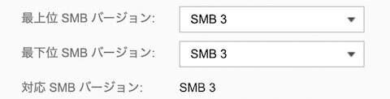 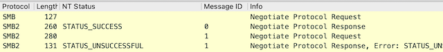

### QNAPをSMB 2固定にしてみる

最初のネゴシエーションでQNAPからはSMB 2は使えるよと返しています。

そこで、QNAP NASの設定でSMB 2固定にしたところ、ようやくアクセスできました。

 

この設定にするとQNAPはSMB 2.0.2が使えると返しているようです。

これで無事次のやりとりであるセッションの初期化がはじまります。

### なぜネゴシエーションに失敗するのか？

とりあえずQNAPの設定をSMB 2に固定にすることでデータにアクセスすることはできるようになりました。SMB 3をサポートしているのに、ネゴシエーションでSMB 3を返さないのかは現時点ではわかりません。

このようなトラブルの報告はTwitterなどにもあがっていないので、私の環境だけなのかもしれません。一度QNAPを初期化してみるのが良さそうですが、まずはバックアップしてからになります。

### QNAPの設定のリセットをしてみる

QNAPサポートには連絡しましたが、今のところ回答はなく症状からして、NASの初期化しか復旧手段が無いように思われました。データロストが起こっても大丈夫なように、まずは外付けディスクにバックアップを取得しました。これはHBS 3 Hybrid Backup Syncで簡単に取得できますが、やはり時間はかかります。

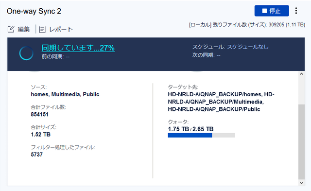

そのあとに「工場出荷時設定に復元」→「設定リセット」（設定のみリセットし、ハードディスクにユーザデータは保持される）を行い、QNAPを再設定しましたが状況は変わりませんでした。

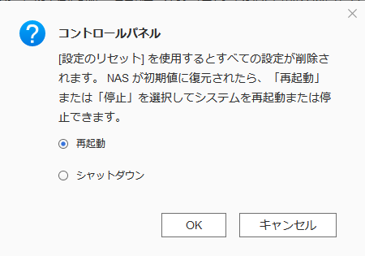

### ＱTS 5.0.0 public betaにしてみる

やはりNASの再初期化を行うしかなさそうですが、その前に最近[QTS 5.0.0.1716 Build 20210701 Public Beta](https://www.qnap.com/ja-jp/release-notes/qts/5.0.0.1716/20210701 "QTS 5.0.0.1716 Build 20210701 Public Beta")がリリースされたので試しにアップデートしてみました。

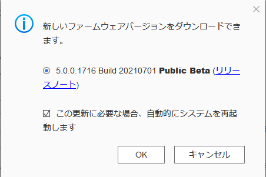

しかし状況は変わりませんでした。ちなみにこのQTS 5.0.0 public betaでsmb2statusを動かしたところ、表示されるsambaのバージョンはQTS4.5.4.1723 build 20210708のものと同じでした。

### NASの再初期化をしてみる

最終手段のNASの再初期化です。これを行うとQTSが再インストールされハードディスクはフォーマットされます。

QTS 5.0.0 betaが再インストールされゼロからセットアップです。セットアップ画面は昔のQTSとは異なりデザインが洗練されているように思えました。adminアカウントもデフォルトでは無効になりセキュリティの面も強化されているようです。

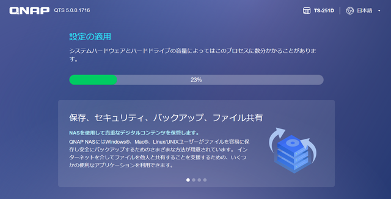

### 無事SMB 3が復旧しました

まずは自分のアカウントだけ登録し、初期フォルダのpublicだけの状態で、Windowsからアクセスしてみたところ、問題なく共有フォルダがみえました。念のためWiresharkでSMBプロトコルも確認しましたが、今回はSMB 3.1.1が返ってきています。

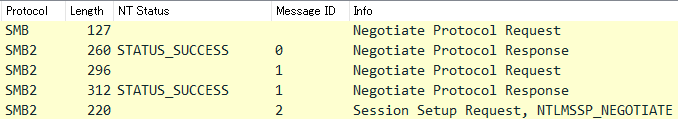 

あとは外付けディスクからHBS3でNASにコピーして復旧が完了しました。

結局、何が原因だったのかはわかりませんでしたが、動作がおかしくなった場合はバックアップ後にNAS再初期化がよさそうです。
